# Проявка

Обычно я начинаю обработку с выбора и проявки наиболее типичного (опорного) кадра, который потом можно будет использовать как основу для проявки всех остальных кадров съёмки.

Я стараюсь не обрабатывать фотографии сразу (за один день). Лучше на следующий день посмотреть ещё раз и подкрутить при необходимости.

Ниже я опишу примерный порядок проявки фотографии в Лайтруме. Точный порядок не так уж важен, и я сам не всегда делаю так, как написано ниже. Часто я пробую разное кадрирование или чёрно-белый вариант ещё на этапе отбора, и часто кручу одни и те же ручки в разном порядке в течение нескольких дней, а то и недель, пока фотография не начнёт мне нравиться, или не будет отправлена в корзину.

## Интерфейс

### Просмотр изменений

Чтобы понять, стало ли лучше после ваших правок, можно сравнить обработанную фотографию с исходной, нажав клавишу Y.

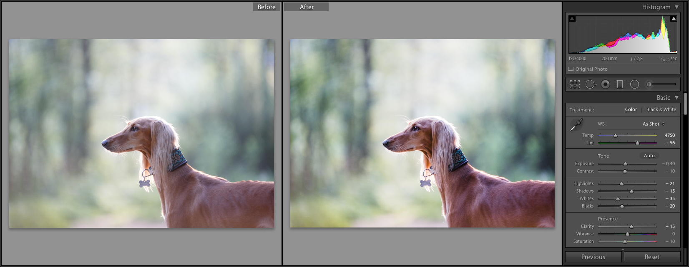

А нажимая клавишу \, можно переключаться между обработанной и исходной фотографиями.

Нажав клавишу F, можно скрыть все элементы интерфейса, и развернуть фотографию во весь экран. А нажимая клавишу L один или два раза, можно просто затемнить или спрятать элементы интерфейса. Так можно лучше оценить результат обработки, не отвлекаясь на разноцветные кнопки и ползунки Лайтрума.

Так же можно отключать влияние отдельных панелей переключателями в левой части их заголовков.

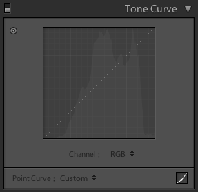

### Отмена изменений

Лайтрум хранит историю всех ваших действий, поэтому вы в любой момент можете вернуться к одному из предыдущих состояний обработки фотографии:

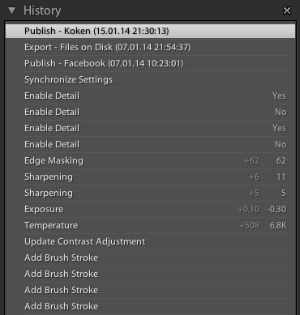

Установить значение по умолчанию для любого ползунка можно двойным кликом по его названию (например, Exposure). А кликнув по заголовку группы, удерживая клавишу Alt, можно сбросить все ползунки группы:

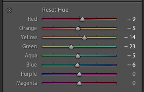

## Профили камер

Первое, что я делаю при обработке — выбираю профиль камеры в панели Camera Calibration.

В Лайтруме есть несколько встроенных профилей (Adobe Standard, Camera Neutral, Camera Landscape и другие), но есть и много альтернативных: эмулирующих разные плёнки ([Replichrome](http://www.gettotallyrad.com/replichrome/), [VSCO Film](http://vsco.co/film)), обещающих более правильные цвета ([Huelight](http://www.colorfidelity.com/)).

Я обычно использую Реплихром и иногда Хьюлайт. Стандартные профили — очень редко.

Если выкинуть из Реплихрома всё лишнее (зерно и тому подобное хипстерство) и оставить только цвет, то получается неплохая основа для дальнейшей обработки. Эмуляция плёнки как цель мне не интересна.

Для этого я переделал пресеты, входящие в комплект Реплихрома: удалил лишние, оставив по одному пресету для каждой плёнки, и вычистил ненужные параметры, отредактировав файлы пресетов. Получилось вот так:

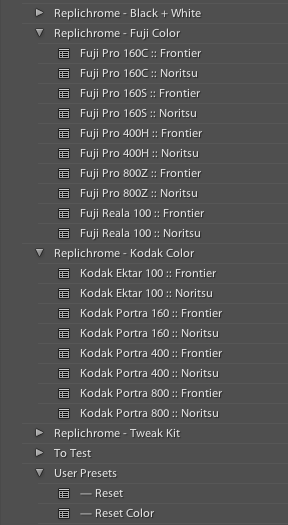

С выбора одного из этих пресетов я и начинаю обработку.

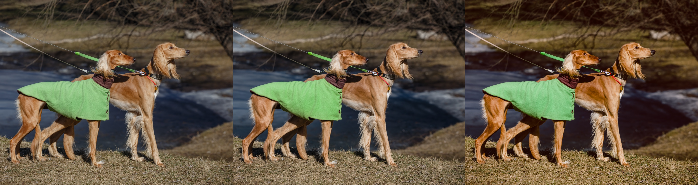

## Баланс белого

Одновременно с выбором профиля я выбираю баланс белого. При съёмке я почти всегда ставлю автоматический баланс белого, и часто не трогаю его при обработке.

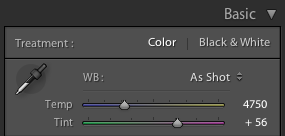

Баланс белого можно задать тремя способами:

1. Вручную: ползунками Temp и Tint.

2. Выбрав значение из списка WB. Там примерно те же значения, что можно выбрать в камере: Auto, Daylight, Cloudy и тому подобные.

3. Пипеткой. Кликните кнопку с пипеткой (White Balance Selector), а потом в любое место фотографии, которое должно иметь нейтральный (серый) цвет.

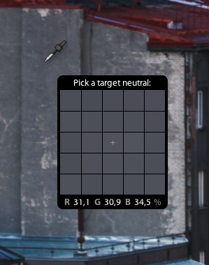

## Кадрирование

Tools — Crop (R).

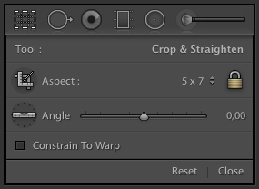

Фотографы давно спорят, как именно можно кадрировать фотографии и можно ли вообще. Я считаю, что кадрировать можно и нужно, но лучше стараться это делать ещё при съёмке.

Так же я считаю, что нужно ограничиваться каким-то определённым набором соотношений сторон: у меня это стандартный 2×3, 4×5, 5×7, 1×1, 1×2 и 1×3. 4×5, 5×7 и 1×1 — самые любимые.

Соотношение сторон можно выбрать из списка рядом с замком на панели Crop & Straighten. Замок тоже стоит нажать, чтобы Лайтрум не позволял задавать произвольные соотношения сторон.

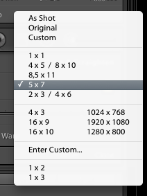

Можно добавить и свои соотношения сторон — выберите Enter Custom в этом списке.

Лайтрум позволяет накладывать на изображение сетку третей, волшебные спирали и прочее мракобесие, которое так любят авторы учебников фотографии. Лучше это сразу отключить, чтобы случайно не начать использовать: Tools — Tool Overlay — Never Show.

Поменять вертикальную рамку на горизонтальную и наоборот можно нажав клавишу X, а можно нажать кнопку Crop Frame Tool (иконка рамки рядом с надписью Aspect) и заново растянуть рамку кадрирования в нужном месте изображения.

Кроме собственно кадрирования инструмент Crop & Straighten позволяет выправить заваленный горизонт. Для этого нужно нажать кнопку с линейкой и провести мышкой по любой горизонтали на фотографии (чаще всего — по линии горизонта). Или вручную задать угол поворота ползунком Angle.

Галка Constrain to Warp препятствует появлению серых областей при коррекции оптических искажений (об этом ниже).

## Контраст

Основные регулировки контраста и яркости фотографии находятся на  панели Basic.

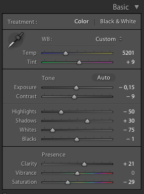

Это, во-первых, экспозиция (Exposure) и контраст (Contrast). Ползунок Exposure — аналог экcпокоррекции в камере — делает все пиксели изображения светлее или темнее. С той лишь разницей, что возможности тянуть рав-файл не бесконечны. Ползунок Contrast — самый грубый инструмент регулировки контраста.

Во-вторых, Highlights, Shadows, Whites и Blacks. Эти инструменты чаще всего используются для регулировки контраста изображения. Кроме, собственно, контраста они помогают убирать пересветы (в разумных, но довольно широких пределах) и вытягивать тени. И то и другое делается без превращения фотографии в HDR-подобное месиво цветных пикселей.

Более точно можно настроить контраст кривой (Tone Curve).

По умолчанию кривая в Лайтруме не очень-то похожа на кривую, потому что состоит из четырёх точек и странного интерфейса для их настройки. Чтобы получить нормальную кривую, нужно нажать кнопку с изображением кривой в правом нижнем углу панели.

К контрасту можно отнести и ползунок Clarity. Этот ползунок увеличивает контраст средних тонов. Визуально это приводит к усилению текстур и деталей. Часто небольшое усиление Clarity (10—20; чёрно-белые фотографии выдерживают гораздо большие значения) делает фотографию лучше, но не стоит злоупотреблять этим инструментом. Часто лучше применять его к отдельным частям изображения с помощью кистей (об этом ниже).

### Проверка пересветов и провалов в тенях

Если вам важно, чтобы фотография не имела пересветов и провалов в тенях, то можно включить режим показа отсечений (View — Show Clipping, или клавиша J). Или с помощью треугольников в верхней части гистограммы:

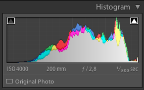

Левый — тени, правый — света. Если треугольник белый, значит в этой части фотографии есть отсечения. На фотографии они будут показаны красным (света) и синим (тени):

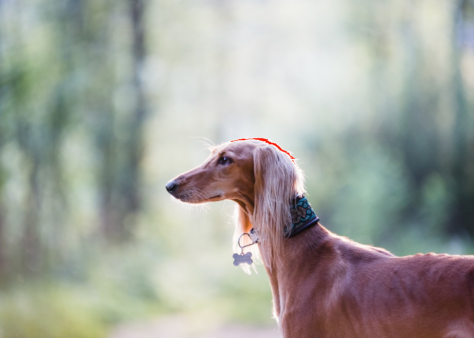

Так же можно удерживать клавишу Alt при изменении таких параметров как Exposure, Highlights, Shadows, Whites, Blacks

## Цвет

Для работы с цветом в Лайтруме есть несколько инструментов:

* Баланс белого.
* Saturation/Vibrance.
* Панель HSL.
* Панель Split Toning.
* Панель Camera Calibration.
* Поканальные кривые.

Кроме того можно менять цвет определённых частей фотографии с помощью кистей и градиентов, но об этом ниже.

Про баланс белого уже поговорили, теперь про всё остальное.

### Saturation/Vibrance

Глобальные настройки насыщенности (Saturation) и Vibrance в панели Basic тоже влияют на цвет.

Vibrance, в отличии от Saturation, увеличивает насыщенность не одинаково для всех цветов. Насыщенность изначально менее насыщенных цветов увеличивается сильнее, а насыщенность ярких цветов и телесных тонов, наоборот, слабее.

Vibrance я почти никогда не пользуюсь, а насыщенность обычно немного снижаю.

### Панель HSL

Эта панель позволяет менять тон, насыщенность и яркость (Hue, Saturation, Luminance) отдельных цветов изображения: убавить насыщенность красного, сделать небо потемнее, траву позеленее — это всё тут.

Панель имеет три режима:

1. HSL. Переключатели в шапке панели (Hue, Saturation, Luminance, All) позволяют показать на экране все группы сразу или только одну. Я всегда выбираю All: меньше ненужных кликов и так сразу видно все текущие значения. Имейте ввиду, что группы настроек только скрываются с экрана, но их воздействие на изображение не отменяется. Для выключения панелей используйте переключатели слева от названий панелей.

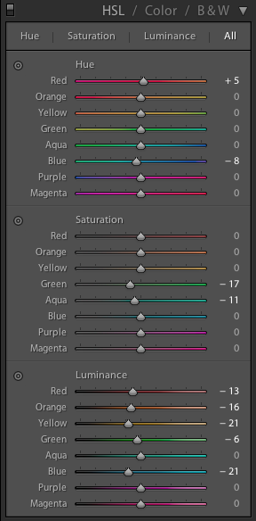

2. Color. Те же ползунки, что в и режиме HSL, но сгруппированные по цвету, а не по типу.

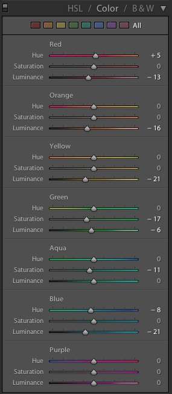

3. B&W. Как видно из названия, этот режим используется для регулировки чёрно-белых фотографий. О них мы ещё поговорим.

Я всгда использую режим HSL. У него есть один важный плюс по сравнению с режимом Color: возможность выбирать цветовые значения, кликая по фотографии. Нажмите кружок слева от заголовка группы:

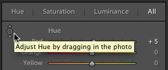

Теперь можно, нажав и удерживая клавишу мышки в нужном месте фотографии, водить ей вверх-вниз и менять тон, насыщенность или яркость именно для этого цвета.

### Панель Split Toning

Эта панель позволяет тонировать фотографию в два цвета: отдельно светлые и тёмные области.

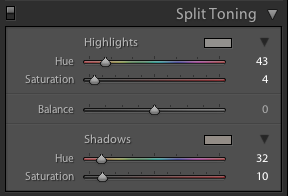

Тут можно выбрать оттенок (Hue) и насыщенность (Saturation) для светов (Highlights) и теней (Shadows), а так же границу светов и теней (Balance).

Оттенок определяет цвет тонирования, а насыщенность — его силу.

Кроме выбора значений ползунками, можно кликнуть в цветной прямоугольник справа от заголовка группы (Highlights или Shadows) и выбрать нужный цвет и насыщенность в открывшемся окне. Там же можно добавить в избранное пять любимых цветов.

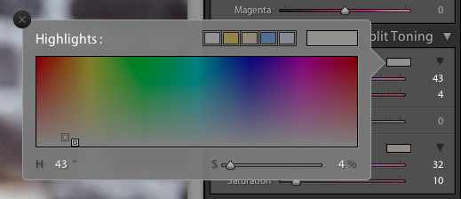

Тонировать можно как цветные, так и чёрно-белые фотографии.

### Панель Camera Calibraiton

Мы уже научились выбирать профиль камеры в этой панели. Но тут есть ещё и регулировки цвета:

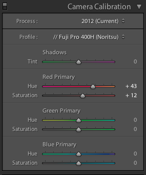

Они менее очевидны, чем крутилки из панели HSL, но иногда они дают именно тот результат, какой мне нужен. Например, и там, и там можно изменить цвет кожи (или цвет шерсти моей рыжей собаки), но результат будет немного разным. Стоит попробовать и те, и другие, чтобы понять, в каких случаях удобнее одни, а в каких — другие.

### Поканальные кривые

Кривые в Лайтруме работают так же, как в Фотошопе. Кроме кривой яркости, есть кривые для каждого цветового канала: красного, зелёного и синего.

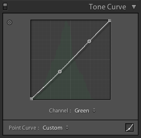

На мой взгляд они работают более грубо, чем кривые в Фотошопе. Во-первых, из-за меньшего размера, а во-вторых, из-за невозможности регулировки стрелками на клавиатуре. Но если есть возможность обойтись при обработке одним Лайтрумом, то я так и сделаю. А если не получится — всегда есть возможность сделать более точную коррекцию в Фотошопе.

## Исправление оптических искажений и перспективы

В Лайтруме есть мощные и удобные инструменты для исправления оптических искажений и перспективы. Все они находятся на панели Lens Corrections.

### Хроматические аберрации

В большинстве случаев для удаления от хроматических аберраций хватает автоматического исправления: галочки Remove Chromatic Aberration. Есть смысл включить её в пресет по умолчанию.

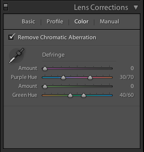

В особенно запущенных случаях можно воспользоваться пипеткой на во вкладке Color. Нужно кликнуть пипеткой в цветную кайму на фотографии, и она исчезнет: Лайтрум сам выберет правильные значения ползунков под заголовком Defringe.

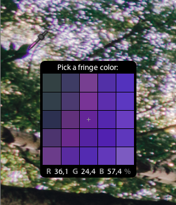

### Оптические искажения

Лайтрум умеет автоматически исправлять дисторсию и виньетирование многих популярных объективов. Для этого нужно поставить галочку Enable Profile Corrections: изображение сразу станет более плоским, а углы станут светлее. Во вкладке Profile будет выбран ваш объектив (если, конечно, он есть в базе Лайтрума).

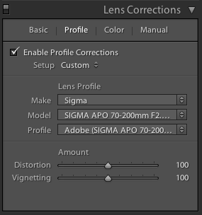

С помощью ползунков Distortion и Vignetting можно усилить или ослабить коррекцию дисторсии или виньетирования. А выставив ползунок в ноль, можно сосвсем убрать какую-то из коррекций.

Я вообще не считаю виньетирование проблемой, и часто сам добавляю его. Но иногда приходится его убирать: например, при съёмке с несколькими фильтрами, или при кадрировании фотографии (так виньетирование становится несимметричным, и лучше добавить его потом).

### Перспектива

Исправление перспективы стоит начать с функции Upright. Для этого надо включить исправление искажений (Enable Profile Corrections) и нажать кнопку Auto под заголовком Upright.

Если результат не подойдёт, то можно попробовать другие режимы: Level, Vertical или Full.

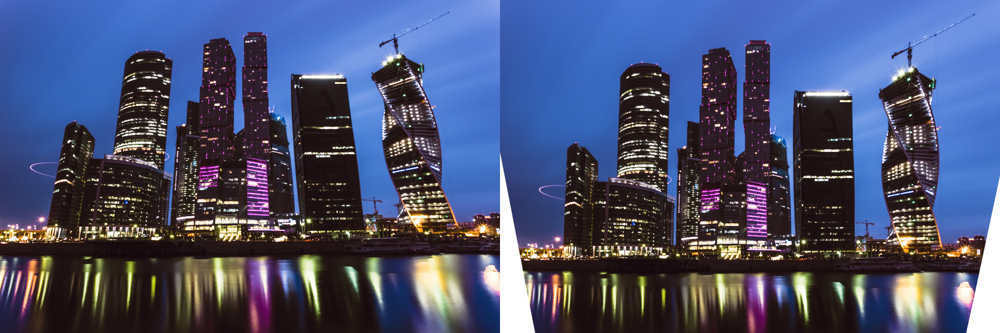

Если и этого будет мало, то можно попробовать исправить перспективу вручную во вкладке Manual. А можно и совместить автоматическую и ручную коррекцию.

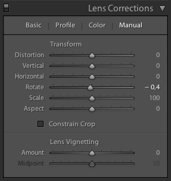

## Повышение резкости

Повышение резкости — вопрос очень религиозный. Фотографы никак не могут договориться, когда же нужно повышать резкость фотографий. Многие считают, что нужно повышать резкость только тогда, когда обработка уже сделана, а фотография уменьшена до итогового размера: например, для веба или для печати. Я и сам так когда-то думал, но сейчас немного повышаю резкость не идеально резких фотографий во время проявки в Лайтруме.

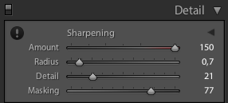

Обычно я просто кручу все крутилки на глаз, удерживая клавишу Alt — в этом режиме лучше видно, к чему приведут изменения.

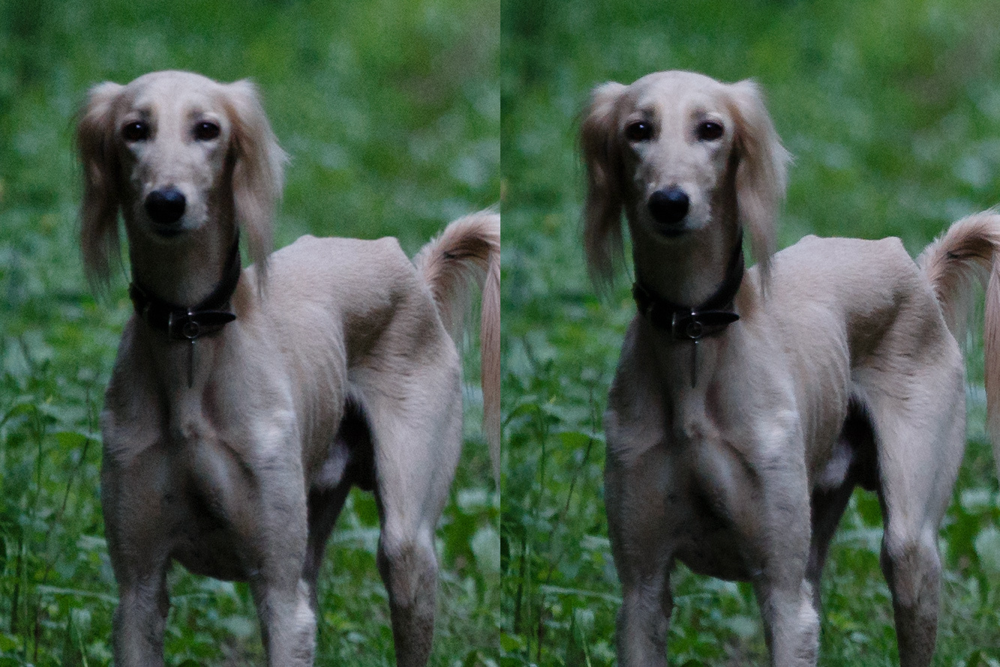

Желательно настраивать резкость в масштабе 1:1. В обычном масштабе эффект почти не заметен.

## Удаление цифрового шума

Цифровой шум когда-то был большой проблемой, но современные цифровые камеры умеют снимать на очень высоких значениях ISO с допустимым уровнем шума. Но даже сейчас подавление шума иногда необходимо.

Существует два вида цифрового шума: цветовой (Color) и яркостный (Luminance). В Лайтруме есть отдельные крутилки для избавления фотографии от них обоих:

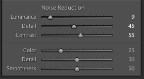

Цветовой шум — это разноцветные пиксели, покрывающие фотографию.  Именно с этим видом шума, на мой взгляд, стоит бороться. В пресете по умолчанию у меня чуть-чуть убирается цветной шум: значения ползунков Color/Detail/Smoothness — 25/50/50.

Яркостный шум чем-то похож на плёночное зерно, и в современных камерах не так уж страшно выглядит. В разумных пределах, конечно, но обычно я его не трогаю.

Шумодав тоже лучше настраивать в масштабе 1:1.

## Добавление виньетирования

Виньетирование может понадобиться не только удалить, но и добавить — многие фотографии становятся от этого лучше. Главное: не увлекаться.

В Лайтруме есть три способа добавить виньетирование.

### Post-Crop Vignetting

Инструмент Post-Crop Vignetting находится на панели Effects. Его основное отличие от крутилок в панели Lens Corrections в том, что он применяется после кадрирования. Поэтому при сильном кадрировании нужно сначала убрать виньетирование со всего кадра в панели Lens Corrections, а потом добавить его уже в панели Effects, чтобы получить равномерное затемнение по всем углам кадра.

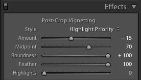

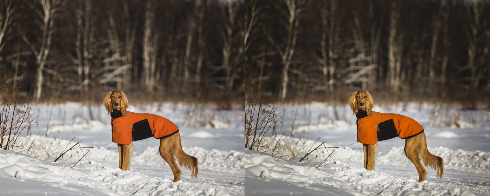

### Радиальный фильтр

Радиальный фильтр (Radial Filter) находится на панели инструментов над панелью Basic. Этот способ отличается от предыдущего возможностью выбрать центр градиента и богатством настроек. Его удобно использовать для выделения главного объекта, находящегося не в центре кадра.

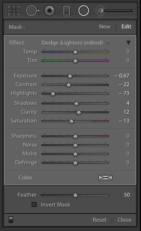

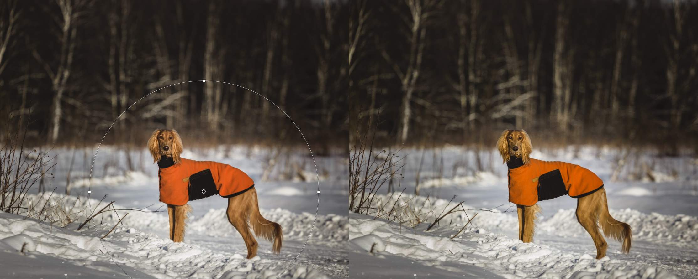

### Кисть

Самый сложный способ, но и самый гибкий: нужно нарисовать область затемнения кистью. Используя этот способ можно, например, не затемнять какой-то важный объект, находящийся у края кадра.

Кисть (Adjustment Brush) находится там же, где и радиальный фильтр, — на панели инструментов над панелью Basic.

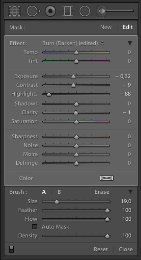

Выбираете большую мягкую (Feather: 100) кисть и рисуете маску затемнения:

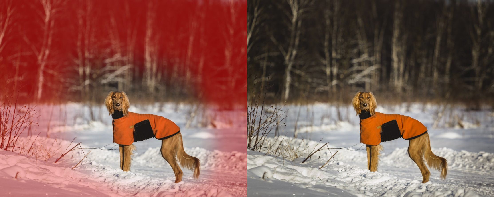

## Добавление зерна

Когда-то я добавлял зерно плагинами для Фотошопа, чтобы замаскировать некрасивый цифровой шум без размытия фотографии шумодавом. Сейчас это уже не нужно, зато зерно можно добавить прямо в Лайтруме.

Зерно добавляется в панели Effects.

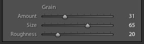

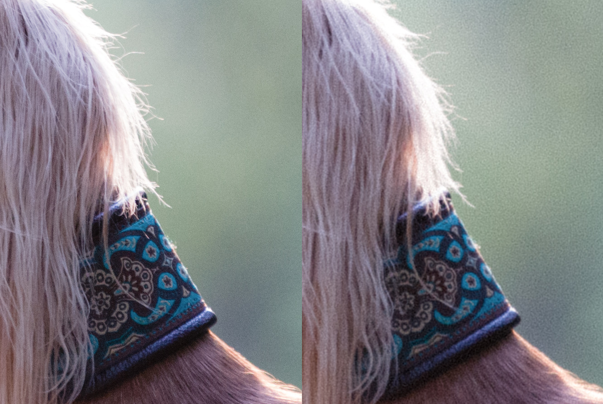

## Пресеты проявки

Любые настройки модуля проявки можно сохранить как пресет, и применять потом одним кликом.

У меня есть пресеты для быстрого добавления виньетирования, тонирования, разных вариантов кривых, выбора профилей и многого другого.

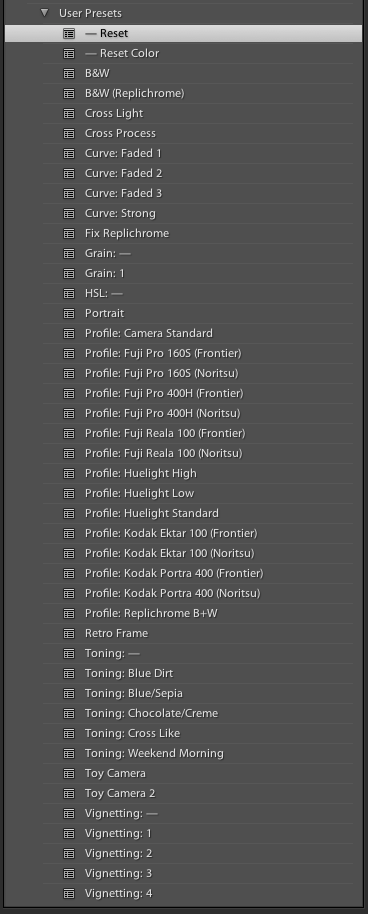

Кроме того, в интернете можно найти огромное количество готовых пресетов: как бесплатных, так и платных (те же Replichrome и VSCO Film).

Чтобы добавить пресет проявки нужно применить нужные параметры к текущей фотографии и нажать кнопку с плюсом в заголовке панели Presets.

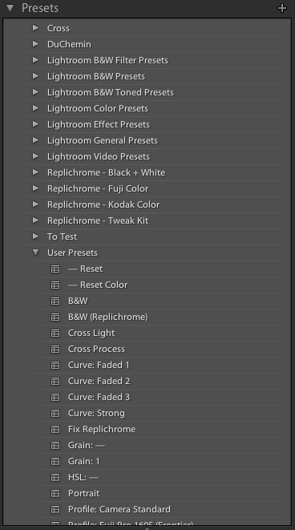

В появившемся окне нужно отметить параметры, которые нужно сохранить в пресет.

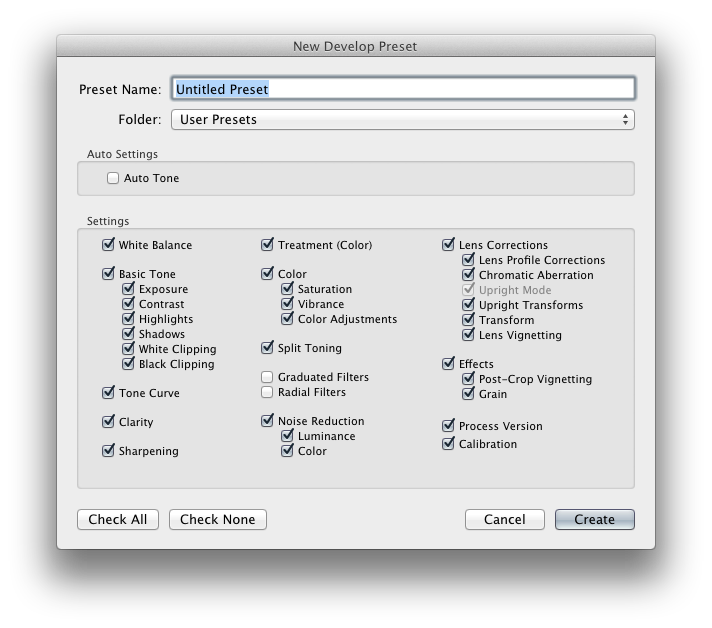

## Выборочная коррекция

### Кисть

Кисть (Adjustment Brush на панели инструментов над панелью Basic, клавиша K) — мощнейший инструмент, позволяющий изменять не всю фотографию целиком, как инструменты рассмотренные выше, а отдельные её части.

Нет смысла перечислять все параметры, которые можно изменять кистью, лучше просто посмотреть:

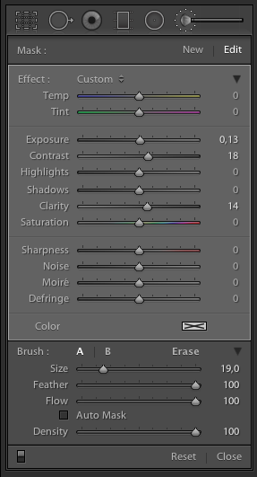

Все они должны быть вам уже знакомы.

У кисти можно менять размер (ползунок Size, клавиши [ и ]) и непрозрачность (ползунок Flow, клавиши 1—0). Остальные параметры я почти никогда не трогаю.

При удерживании клавиши Alt, кисть превращается в ластик, и можно стирать нарисованную маску.

Чтобы увидеть маску на экране, нужно нажать клавишу O (красная маска поверх изображения), а чтобы увидеть отдельные маски — H (белые точки).

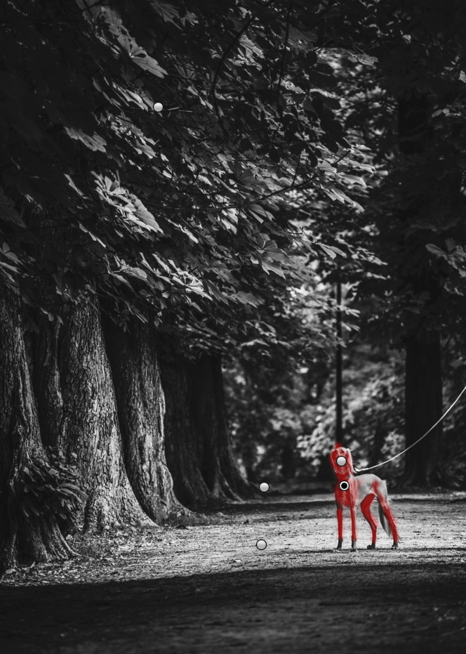

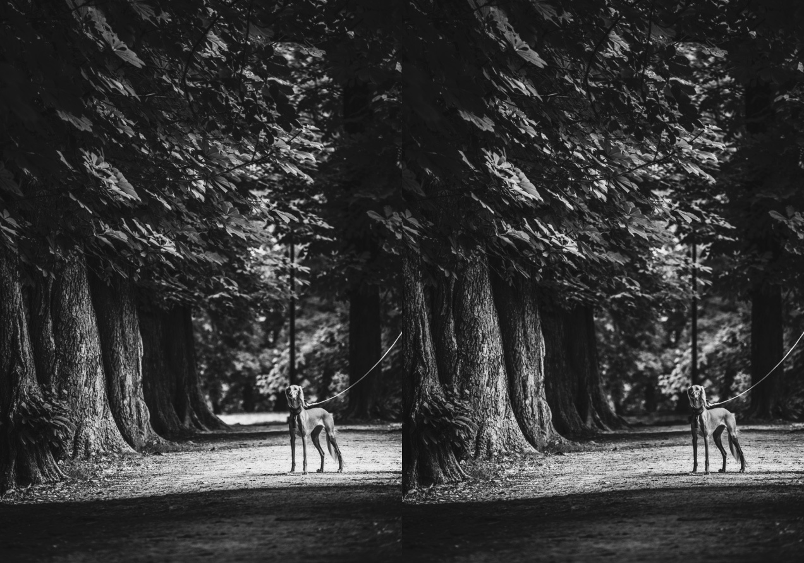

### Градиентный фильтр

Градиентный фильтр (Graduated Filter, клавиша M) — в общем-то так же кисть, но вместо рисованной маски тут градиент.

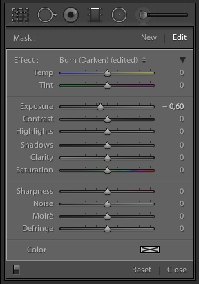

Просто растягиваете градиент в нужном месте фотографии:

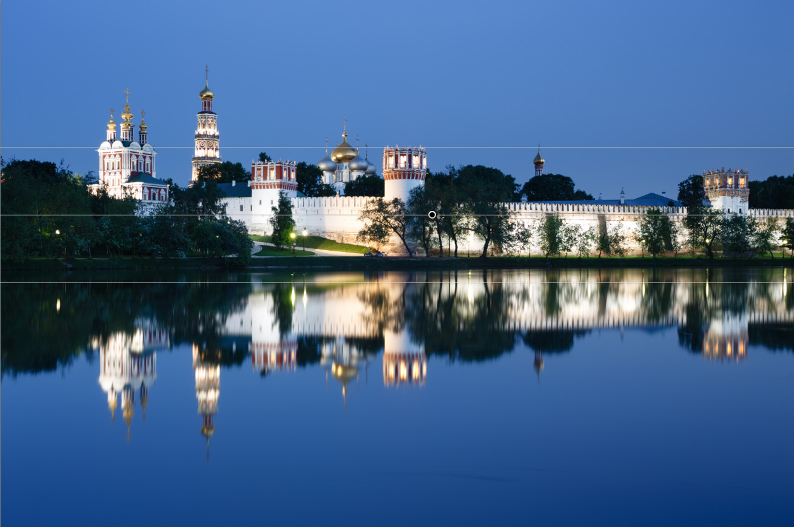

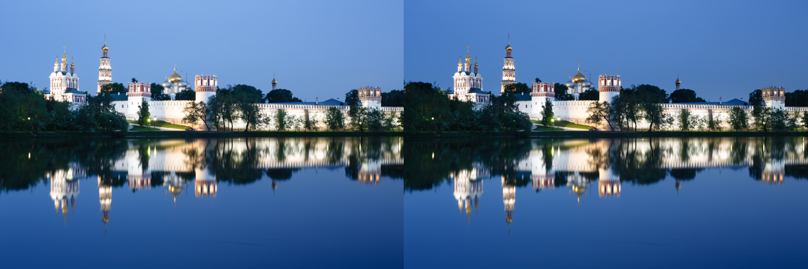

Вторая разновидность градиента — радиальный фильтр (Radial Filter). Всё то же самое, что в обычном градиенте, но форма маски — овальный градиент.

### Ретушь

Чаще всего для ретуши удобнее использовать Фотошоп, но если нужно совсем немного, то можно попробовать сделать это в Лайтруме.

Ретушь делается инструментом Spot Removal (клавиша Q).

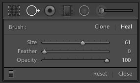

У него есть два режима работы: Clone и Heal. Аналогично Clone Stamp и Healing Brush в Фотошопе. И использовать его можно двумя способами: делать отдельные клики по изображению или одним движением мышки рисовать более сложную маску. В отличии от кисти, после того, как вы отпустите мышку, форму маски отредактировать будет уже нельзя, но можно будет поменять все остальные параметры: диаметр, мягкость, непрозрачность, а так же подвинуть маску или донорскую область.

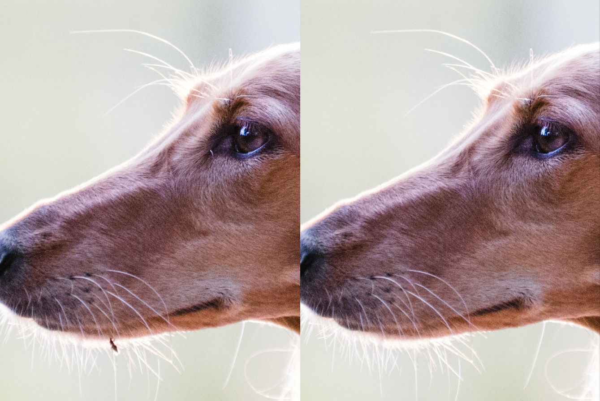

Так же как и в кисти, увидеть все маски можно нажав клавишу H.

### Чистка матричной пыли

Матричную пыль удобно чистить инструментом Spot Removal. Поэтому он так и называется: когда он только появился в Лайтруме, то больше ни для чего не подходил.

Проще всего чистить пыль так: 

1. Увеличиваете фотографию до масштаба 1:1 (клик по изображению или клавиша Z, в панели Navigator слева должно быть выбрано 1:1).

2. Нажимаете клавишу Home (на маках с маленькой клавиатурой: Fn+←) и видите на экране левый верхний угол фотографии.

3. Включаете Spot Removal (клавиша Q), задаёте подходящий размер и кликаете каждую пылинку в видимой области фотографиии.

4. Нажимаете Page Down (Fn+↓). И повторяете шаги 3 и 4, пока не дойдёте до нижнего правого угла фотографии.

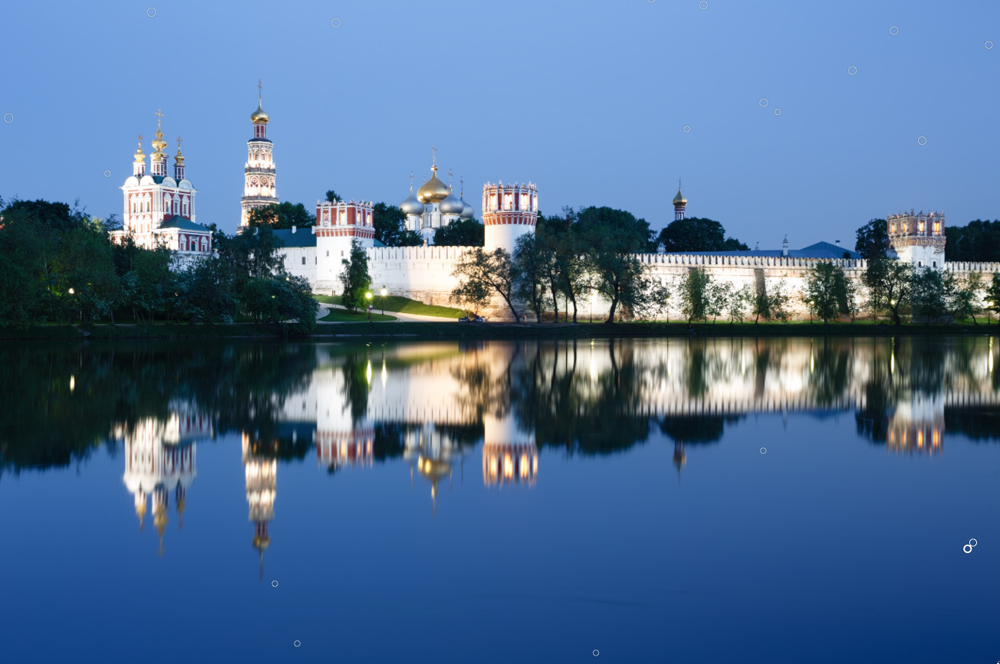

Если пыль плохо видно, можно включить режим Visualize Spots на панели инструментов внизу (если её не видно — нажмите клавишу T).

### Пресеты кистей

Чтобы сохранить текущие настройки кисти в виде пресета, нужно выбрать в списке пресетов Save Current Setting as New Preset.

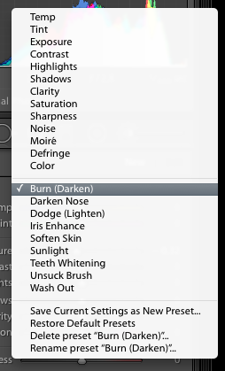

Эти же пресеты можно использовать для градиентного и радиального фильтров.

## Чёрно-белые фотографии

В Лайтруме можно сделать фотографию чёрно-белой двумя способами:

1. Выбрать режим Black & White вверху панели Basic.

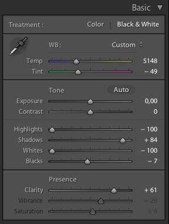

Или выбрать вкладку B&W в панели HSL.

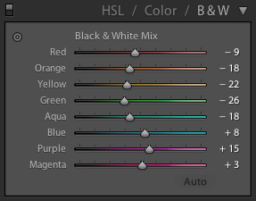

2. Понизить насыщенность всех цветов до 0 (это удобно делать пресетом).

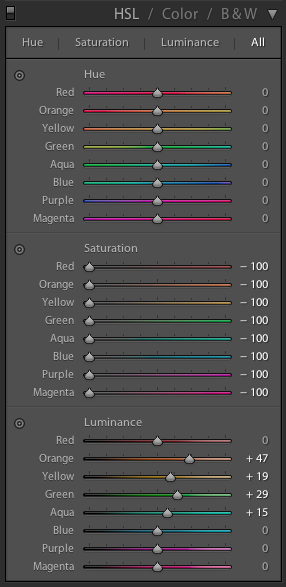

В этом варианте ползунки Luminance будут работать аналогично ползункам Black & White Mix в предыдущем способе.

В обоих вариантах баланс белого и ползунки в панели Camera Calibration влияют на контраст и распределение тонов изображения, но во втором способе на него влияют и ползунки Vibrance и Saturation.

В обоих вариантах можно тонировать фотографию с помощью панели Split Toning или поканальных (цветных) кривых.

Мне почему-то больше нравится второй способ, хотя большой разницы между ними нет.

## Обработка в Фотошопе

Лайтрум становится мощнее с каждой версией, но избежать доработки фотографий в Фотошопе всё ещё удаётся не всегда.

Чтобы открыть фотографию в Фотошопе, выберите в контекстном меню фотографии Edit In — Edit in Adobe Photoshop (Cmd+E).

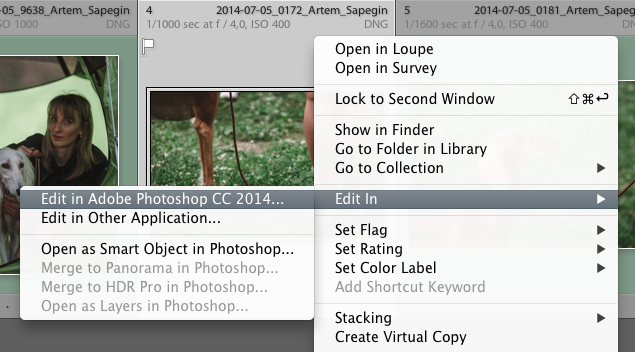

После обработки в Фотошопе вы просто сохраняете файл (имя и папку задавать не нужно) и Лайтрум сам импортирует его в каталог и сгруппирует с исходным рав-файлом.

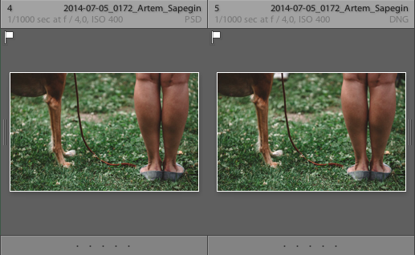

Чтобы снова открыть фотографию в Фотошопе, выделите PSD-файл и выберите в контекстном меню Edit in Adobe Photoshop. Вы увидите такое окно:

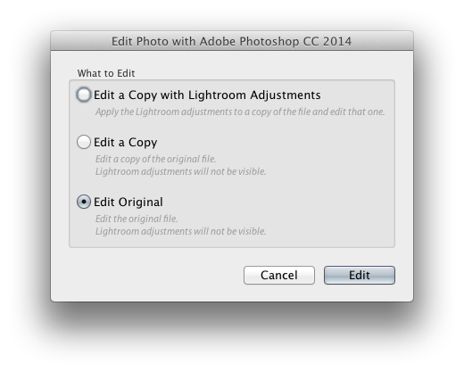

Тут нужно выбрать Edit Original — оригиналом в данном случае и будет ваш PSD-файл. Конечно, вы можете открыть PSD-файл и сразу Фотошопом, не запуская Лайтрум.

Чтобы избежать путаницы, нежелательно обрабатывать PSD-файл ещё и Лайтрумом, хотя это возможно.

### Склейка нескольких файлов

Часто бывает нужно склеить фотографию из нескольких кадров: панорамы, кадры с разной экспозицией или резкостью.

Чтобы сделать это с помощью Фотошопа, нужно выделить файлы и в меню Edit In выбрать другой пункт: Open as Layers in Photoshop.

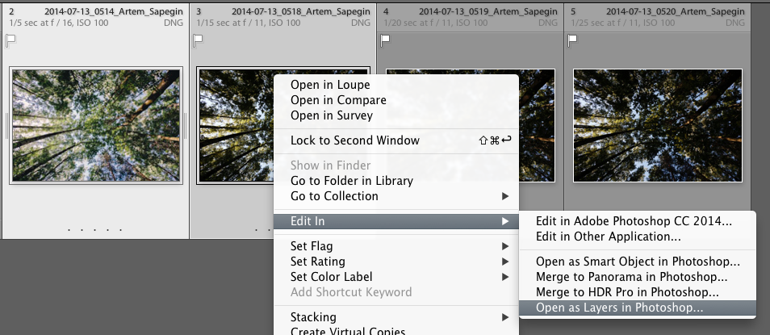

Так в Фотошопе откроется один файл, а каждый выделенный кадр будет на отдельном слое.

Для склейки панорам можно выбрать Merge to Panorama in Photoshop, и Фотошоп сразу начнёт собирать панораму из выделенных кадров.

## Завершение обработки

После завершения обоработки я нажимаю клавишу 8 — ставлю фотографии зелёную метку. Так я отмечаю все обработанные фотографии.

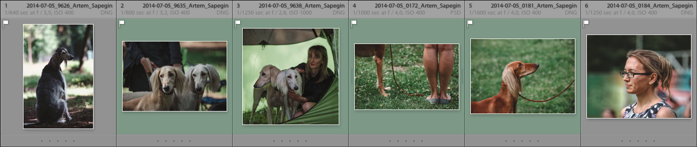

## Синхронизация настроек с другими фотографиями

После обработки опорного кадра, я выделяю все фотографии (опорный кадр должен быть выделен первым) и синхронизирую параметры проявки опорного кадра со всеми остальными: Photo — Develop Settings — Sync Settings, Cmd+Shift+S). 

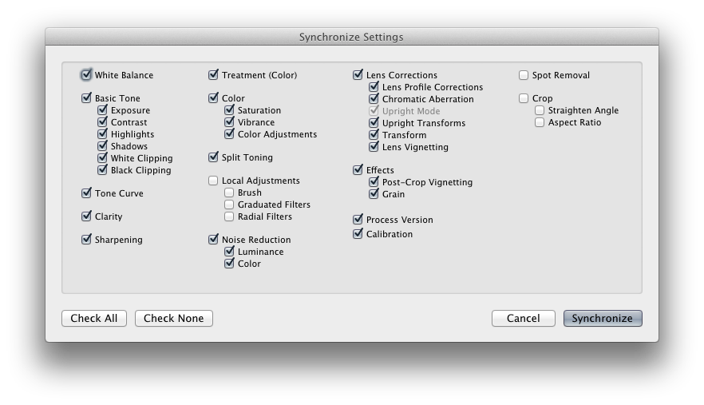

Это станет основой для обработки остальных фотографий съёмки.

Синхронизацию можно применять много раз, выделяя группы похожих фотографий. Это сильно ускоряет обработку и делает её более цельной.

## Виртуальные копии

Иногда хочется попробовать разные варианты обработки одной фотографии. В Лайтруме для этого есть виртуальные копии: это отдельный вариант проявки фотографии, который в каталоге выглядит как другая фотография, хотя рав-файл при этом не копируется.

Чтобы создать виртуальную копию, выберите в контекстном меню фотографии Create Virtual Copy.

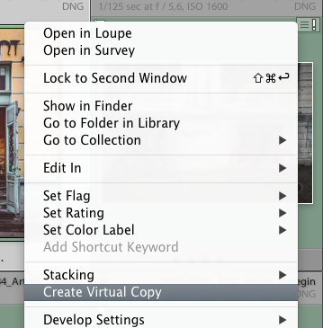

## Пресет по умолчанию

Если вы делаете какие-то изменения для каждой (или почти для каждой) фотографии, то можете изменить пресет по умолчанию так, чтобы Лайтрум сам применял нужные вам изменения при импорте фотографий.

Для этого нужно открыть в модуле проявки любую ещё не обработанную фотографию. Сделать все нужные изменения, и удерживая Alt, нажать Set Default в самом низу правой панели (там, где до нажатия Alt была кнопка Reset).

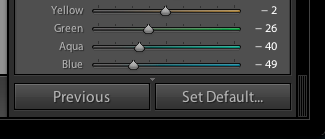

У меня выставлены в ноль все параметры, кроме:

Exposure: –0,40.
Contrast: –10.
Clarity: +5.
Saturation: –10.
Point Curve: Medium Contrast (и включаю режим редактирования кривой по точкам — кнопка справа от списка Point Curve).

Отключено повышение резкости (Sharpening — Amount: 0), а шумодав включен только цветовой (Noise Reduction — Luminance: 0, Color: 25/50/50).

В панели Lens Correction стоит чекбокс Remove Chromatic Aberration. А в панели Camera Calibration в списке Profile выбран профиль Camera Standard.

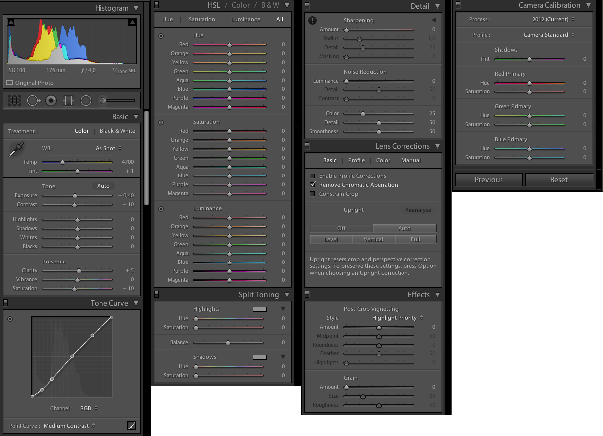

