# Отбор

## Подходы к отбору

Есть три похода к отбору фотографий: выбор хороших, удаление плохих и случайный выбор.

1. **Выбор хороших**. Просмотр всей съёмки и выбор (например, флагами в Лайтруме) понравившихся фотографий с последующей фильтрацией по флагу для уточнения выбора.

2. **Удаление плохих**. Просмотр всей съёмки и удаление «неудачных» фотографий. Так остаётся большая (или меньшая — если фотограф очень строг к себе) часть фотографий для дальнейшей работы. На мой взгляд эффективнее уделять больше внимания хорошим фотографиям, чем плохим. Во всяком случае на самом первом этапе отбора.

3. **Случайный выбор**. Автор выбирает фотографию для обработки, просматривая всю съёмку методом пристального всматривания. Каждая следующая фотография выбирается так же. Этот способ отнимает больше всего времени, и при наличии нескольких похожих фотографий вы рискуете выбрать не самый удачный дубль.

Мой способ отбора больше всего похож на первый с примесью второго.

## Этапы отбора

Я отбираю фотографии в несколько этапов.

### Первый отбор

Просматриваю все фотографии:

* Всем фотографиям, с которыми стоит работать дальше, я ставлю белый флаг (Pick, клавиша P).

* Совсем плохим (нерезким, с закрытыми глазами и тому подобное) я ставлю чёрный флаг (Reject, клавиша X).

Тут главное не думать и действовать быстро. У меня в первый отбор обычно попадает около половины фотографий.

На время отбора удобно включить автоперемотку (Photo — Auto Advance). Так при добавлении флага, изменении звёздочного рейтинга или цветной метки, Лайтрум будет сразу показывать следующую фотографию. Именно это вам и нужно во время отбора.

Убрать флаг можно клавишей U.

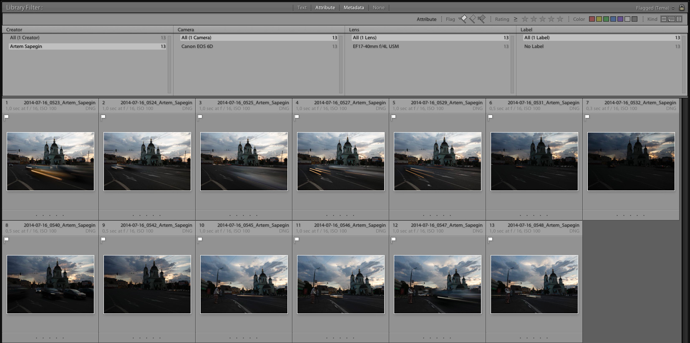

### Подробный отбор

Для начала нужно сделать три вещи:

1. Отфильтровать фотографии по флагу: View — Show Filter Bar (\), в появившейся панели фильтра выбрать Flagged в списке справа.

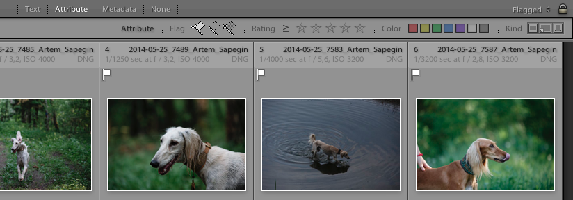

2. Построить полноразмерные миниатюры. Снять выделение: Edit — Select None (Cmd+D) и построить миниатюры: Library — Previews — Build 1:1 Previews. Это позволит оценивать резкость фотографий без необходимости каждый раз ждать, пока Лайтрум отрисует полноразмерное изображение.

3. Отдохнуть пару дней. Делать перерывы в обработке фотографий вообще полезно. Если долго смотреть на одни и те же фотографии, то глаза успевают привыкнуть и перестают замечать, как вы уже накрутили чего-то лишнего.

Теперь можно приступать к подробному вдумчивому отбору.

## Критерии отбора

Я убеждён, что критерий отбора фотографий всего один — нравится или не нравится фотография её автору.

Нормально, когда начинающему фотографу нравятся почти все его фотографии. У многих со временем это проходит: число виденных фотографий растёт, а снимать самому одно и то же становится уже не интересно; вкус постепенно развивается, и в отбор попадает всё меньше и меньше фотографий.

Это правильный и естественный путь, но можно его немного облегчить:

* Больше смотрите *чужих* хороших фотографий. И под хорошими я имею ввиду не раздел «популярное» на фотосайтах. Ходите на выставки, покупайте альбомы, изучайте работы классиков.

* Не ограничивайтесь фотографиями: картины и фильмы, например, не менее полезны и интересны.

* И, конечно, больше снимайте сами. Пробуйте разное; смотрите, что получается; отбирайте лучшее; и повторяйте снова и снова.

## Инструменты отбора

### Просмотр фотографий

Нажмите E или Enter (View — Loupe) и выделенная фотография будет показана во весь экран. Стрелками на клавиатуре (← и →) можно перемещаться вперёд или назад. Как в любой программе — гляделке картинок.

В этом режиме можно ставить и снимать флаги, звёздочки и цветные метки. Так же как и при просмотре миниатюр.

### Увеличение

Чтобы увеличить фотографию — просто кликните в то место, которое нужно увеличить. Масштаб можно задать в верхней части левой панели. Я всегда использую 1:1.

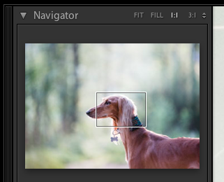

### Фильтрация

Панель фильтра включается клавишей \ (View — Show Filter Bar). Однако, видимость панели никак не влияет на активность фильтра: если в шапке панели подсвечены слова Text, Attribute или Metadata — фильтр включен, если None — выключен.

Фильтр состоит из трёх групп:

* Текстовый фильтр (Text). Это по сути поиск, быстро попасть сюда можно нажав Cmd+F. Можно искать по названиям файлов, ключевым словам и другим параметрам. По умолчанию Лайтрум ищет во всех полях сразу (Any Searchable Field): просто пишете, что хотите найти, и получаете результат.

* Фильтр по свойствам (Attribute): наличие флага, количество звёздочек, цветная метка, тип (основной файл, виртуальная копия, видео).

* Фильтр по метаданным (Metadata): дата, камера, объектив, автор, ключевые слова, диафрагма, фокусное расстояние и другое. Если вам мало четырёх параметров, то можно добавить больше колонок, кликнув по кнопке в правой части заголовка колонки и выбрав Add Column.

Любой набор фильтров можно сохранить как пресет. Для этого нужно в списке в правой части панели фильтра выбрать Save Current Settings as New Preset. После сохранения новый пресет появится в верхней части этого списка.

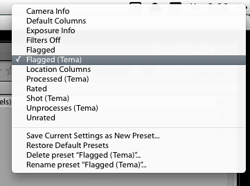

Важные замечания:

* Лайтурум всегда ищет только внутри текущей папки или коллекции. Чтобы искать сразу по всему каталогу, выберите All Photographs в верхней части левой панели:

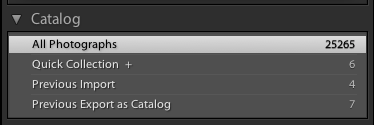

* Фильтры во всех группах применяются одновременно.

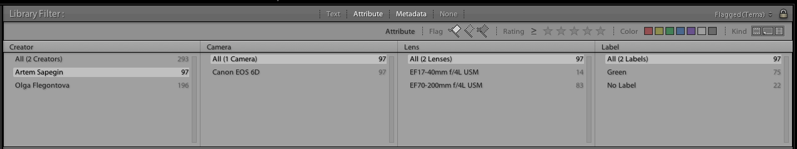

* Клик по заголовку активной группы (той, название которой выделено белым цветом) отменяет все фильтры, выбранные в этой группе.

* Если после импорта вы видите пустой экран, значит у вас остался включенным фильтр с прошлой съёмки. Снимите галку Library — Enable Filter (Cmd+L) или нажмите None на панели фильтра, и вы увидите свои фотографии.

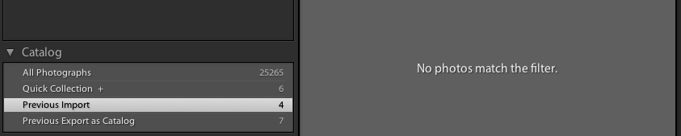

* По умолчанию Лайтрум сбрасывает фильтр как только вы переходите в другую папку или коллекцию. Если вам это неудобно, нажмите замок в правой части панели фильтра.

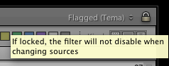

### Просмотр информации о фотографиях

В режиме просмотра фотографии (Loupe, клавиша E) нажмите клавишу I один или два раза, чтобы посмотреть имя файла, экспозицию и другие параметры.

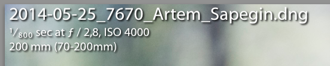

Чтобы скрыть информацию, нажмите I в третий раз.

Состав информации для обоих блоков можно настроить (см. главу Подготовка).

## Распылитель

Распылитель (Painter) — интересный инструмент, которым мало кто пользуется. Он позволяет одним кликом применить к фотографии одно заранее выбранное свойство. Свойств на выбор довольно много: звёздочки, цветные метки, флаги, пресеты метаданных, пресеты ключевых слов, пресеты проявки и добавлене в коллекции.

Звёздочки, цветные метки, флаги, на мой взгляд, удобнее добавлять горячими клавишами, а вот для всего остального распылитель очень удобен.

Распылитель включается на панели инструментов (нажмите T, если панели нет на экране): нажмите кнопку с распылителем (Painter, если её тоже нет — нажмите стрелку в правой части панели инструментов и выберите там Painter).

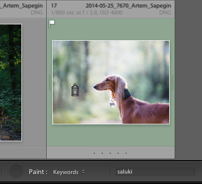

### Сравнение двух фотографий

Выделите две фотографий и нажмите View — Compare (C). В этом режиме удобно выбирать из двух фотографий более резкую или с более удачным моментом. Этот режим особенно удобен тем, что обе фотографии увеличиваются и перемещаются синхронно. Например, кликнув глаз модели, вы сразу увидите, на какой из фотографий он резче.

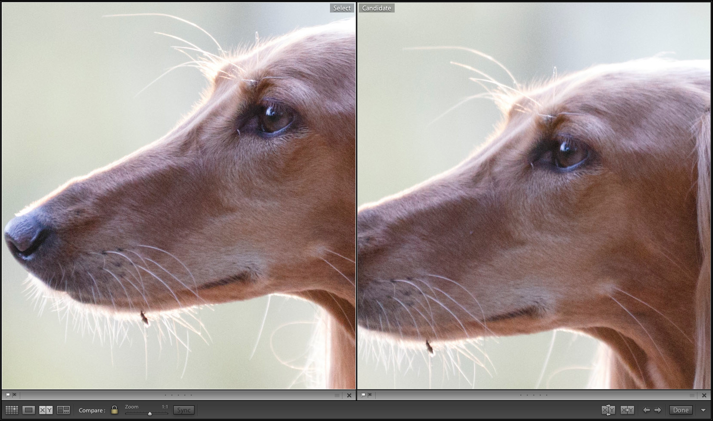

Тут я просто снимаю флаг (нажимаю U, предварительно кликнув эту фотографию, чтобы выделить её) с худшей фотографии, и она пропадает из списка отобранных фотографий.

Можно выделить сразу много много фотографий: сравниваться по-прежнем будут только две, но при снятии флага с худшей из двух, на её месте будет появляться следующая, пока не останется только одна, лучшая, фотография.

### Выбор из нескольких фотографий

Выделите две или больше фотографий и нажмите View — Survey (N). Этот режим не так удобен, как Compare, зато все фотографии видны сразу. С его помощью удобно выбирать, например, снимок с лучшим моментом, — когда лучший вариант видно без увеличения.

В этом режиме я просто выбираю худшие фотографии методом «пристального всматривания» и снимаю с них флаг. Они тут же исчезают экрана, а заодно из списка отобранных фотографий.

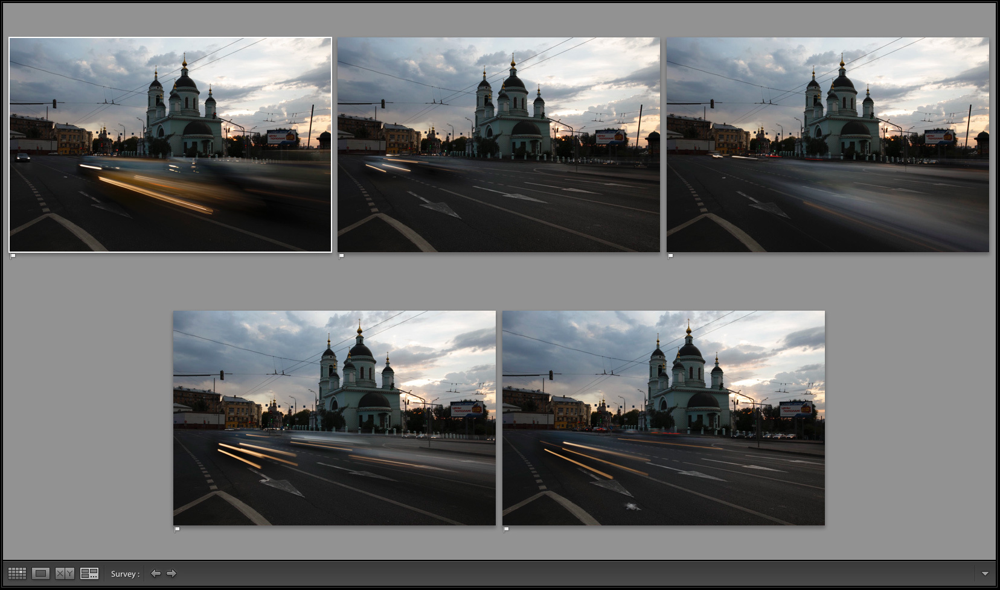

Если плохих фотографий больше нет, а хороших осталось больше одной, то можно продолжить отбор в режиме Compare (просто нажмите клавишу C).

Не нажимайте крестик для отбраковки менее удачных фотографий: в отличии от снятия флага, это всего-лишь уберёт фотографию с экрана отбора Survey, но не уберёт её из списка отобранных.

## Отбор похожих фотографий

Часто похожие фотографии идут не подряд, а разбросаны по всей съёмке. Например, одна и та же поза или движение при съёмке животных или людей; одни и те же музыканты при съёмке концерта и так далее.

Если фотографий немного, можно просто выделить все похожие удерживая Cmd и нажать N — выделенные фотографии отобразятся в режиме Survey (см. предыдущий раздел).

Но работать с выделенными файлами удобно не всегда. Часто удобнее как-то отфильтровать нужные фотографии и дальше работать  с фильтром. Есть несколько способов это сделать:

1. Добавить похожим фотографиям ключевые слова. Мой любимый способ. Отлично подходит для отбора людей и животных: просто добавляете каждой фотографии ключевое слово с именем и фильтруете по этому ключевому слову.

Ключевые слова добавляются в правой панели модуля библиотеки. В панели Keywording есть поле Click here to add keywords: кликаете в него и пишете нужные ключевые слова через запятую.

Чтобы не вводить одни и те же ключевые слова несколько раз, можно выделить несколько фотографий, и добавить ключевые слова сразу всем. Или можно выбрать Recent Keywords в списке Keyword Set: появится панель с девятью последними ключевыми словами. Или использовать распылитель (см. ниже).

Чтобы отфильтровать фотографии по ключевому слову, нужно открыть панель фильтра (клавиша \), кликнуть заголовок Metadata, затем кликнуть заголовок одной из колонок, выбрать Keyword, и в появившемся списке выбрать нужное ключевое слово.

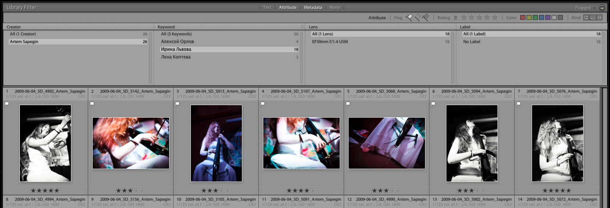

2. Добавить фотографии в быструю коллекцию (Quick Collection). Этот способ похож на выделение с клавишей Cmd. Нажимаете клавишу B на нужных фотографиях, и они попадают в специальную коллекцию.

Открыть быструю коллекцию можно из левой панели модуля библиотеки — Quick Collection в её верхней части. Другой способ — правый клик мышки по миниатюре, добавленной в быструю коллекцию, — Go to Collection — Quick Collection.

Перед тем, как пользоваться быстрой коллекцией, её, скорее всего, нужно будет почистить: File — Clear Quick Collection (Cmd+Shift+B).

Вернуться обратно в папку можно, кликнув правой клавишей мышки по любой миниатюре: Go to Folder in Library.

3. Любой незадействованный способ отбора фотографий: звёздочки, цветные метки.

## Использование звёздочек и цветных меток

Многие фотографы используют звёздочки или цветные метки для боле точной фильтрации фотографии. Например, пять звёздочек — фотография для портфолио, четыре — в блог, три — в семейный альбом и так далее. Или: красная метка — портфолио, жёлтая — блог, зелёная — семейный альбом.

И то, и другое удобно назначать с помощью клавиатуры: цифры 1—5 — звёздочки; 6—9 — цветные метки (кроме фиолетовой). По ним можно фильтровать фотографии, причём фильтровать по количеству звёздочек можно как по точному, так и по наибольшему или наименьшему.

Мне редко нужна такая точность, а звёздочки я использую, когда нужно отобрать и обработать много фотографий: например, из поездки на несколько дней. В таком случае я выбираю для всех фотографий произвольный рейтинг: чем больше звёздочек, тем лучше фотография. Это так же позволяет отложить отбор менее интересных фотографий на потом и сосредоточиться на самых лучших. А уже потом решить, стоит ли вообще тратить время на те, что похуже.

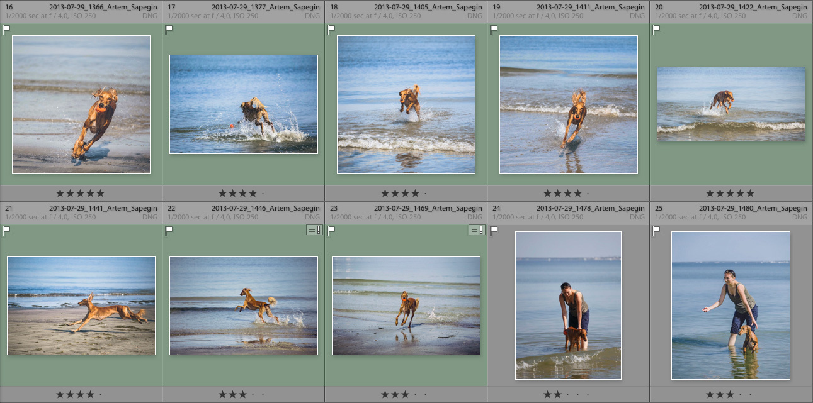

## Панорамы и HDR

Когда одну фотографию предполагается собирать из нескольких рав-файлов (в Фотошопе или другой программе, потому что Лайтрум не умеет совмещать несколькими фотографий), я выделяю все исходные снимки для одной фотографии и нажимаю Cmd+G. Так они объединяются в группу и в интерфейсе выглядят как одна фотография.

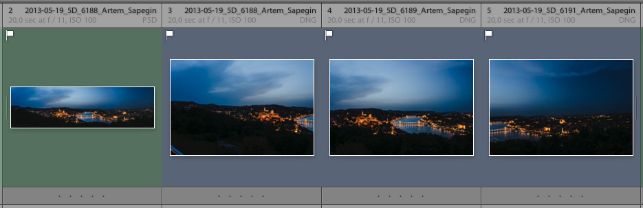

Что делать с такими группами дальше, я расскажу в следующей главе.

## Что делать, если одной камерой снимали несколько фотографов

Когда несколько человек снимают одно и то же одной камерой, самое сложное — понять после импорта в Лайтрум, где чьи фотографии. У всех получается примерно одно и то же: то же место, те же модели. Для этого я пользуюсь простым лайфхаком: всякий раз, когда отдаю камеру жене или она отдаёт её мне, я снимаю свою руку.

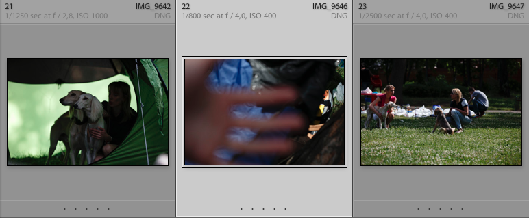

А после импорта просто выделяю блоки фотографий «от руки до руки» и выставляю правильный пресет метаданных из контекстного меню.

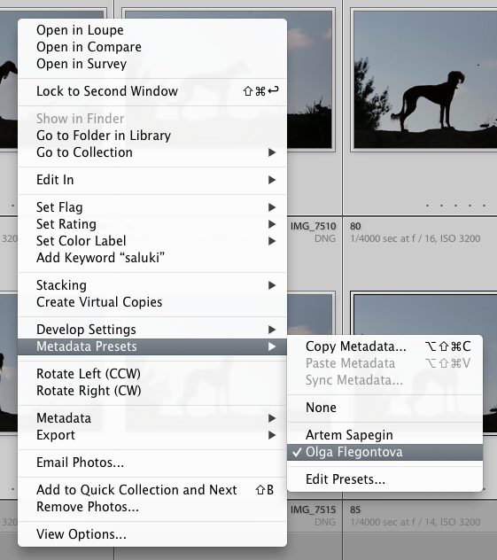

В этом случае важно не переименовывать файлы во время импорта, если схема именования зависит от фотографа (например, имена файлов содержат имя автора): Лайтрум не всегда справляется с повторным переименованием. Так что последовательность должна быть такой: импорт без переименования; назначение метаданных; переименование отдельно для каждого автора.

Чтобы отфильтровать фотографии одного автора, нужно открыть панель фильтров (клавиша \), выбрать раздел Attribute, кликнуть по заголовку любой колонки (например, Date), выбрать там Creator, а потом ваше имя.

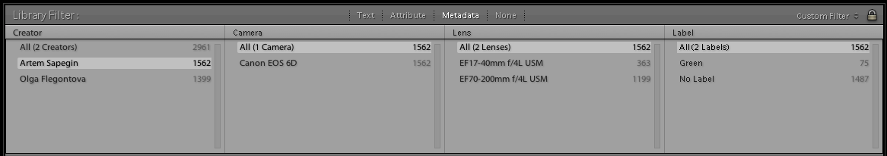

## Удалять ли фотографии

Фотографы расходятся во мнениях, стоит ли удалять фотографии: одни говорят, что надо удалять всё, что не идёт в обработку (в моём случае это все файлы без белого флага); а другие думают, что удалять фотографии никак нельзя (вдруг там затаится шедевр, который автор найдёт лет через десять, и сразу станет знаменитым на весь мир).

Я придерживаюсь принципа наименьших раздумий: удаляю только то, что мне точно никогда не пригодится: нерезкие снимки, с закрытыми глазами, с чьей-то рукой в полкадра; то есть те, что получают чёрный флаг во время отбора.

Получается, что фотографии делятся на три группы: немного лучших, немного брака и большая масса просто никаких. Я стараюсь уделять больше всего внимания первой группе, а остальное просто скрывать фильтром. Местом на диске под рав-файлы в наше время дорожить уже не стоит. Ну а распознать бракованную фотографию при первичном отборе и нажать чёрный флаг времени вроде как не отнимает.

Ещё один момент: никакие фотографии иногда всё-таки пригождаются. Например, когда хорошая фотография хороша во всём, кроме одной маленькой части, которая как раз оказалась хороша на никакой, и её можно оттуда пересадить.

Когда я заканчиваю отбор фотографий, то нажмаю Cmd+Backspace (Photo > Delete Rejected Photos), а затем Delete From Disk. И Лайтрум удаляет с диска все фотографии с чёрным флагом.

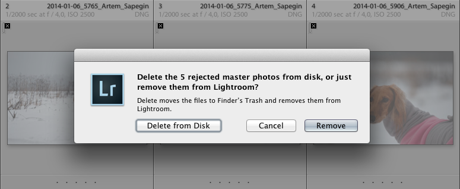

