# Экспорт и архивирование

## Экспорт

Когда-то я экспортировал фотографии из Фотошопа с помощью [собственных скриптов](http://sapegin.ru/projects/pew), которые уменьшали фотографии до нужного размера, добавляли рамку и подпись, повышали резкость (фильтром Smart Sharpen в канале яркости, с возможностью поменять параметры во время экспорта) и сохраняли файлы на диск.

Сейчас всё гораздо проще: во-первых, Лайтрум умеет делать почти всё, что я перечислил выше, а, во-вторых, почти всё это мне уже не нужно. Раньше я готовил разные файлы для разных сайтов: разный размер, с рамкой или без и тому подобное. Сейчас большинство сайтов сами уменьшают фотографии до нужного размера, поэтому можно просто загружать полноразмерные файлы. А от рамок и подписей я давно отказался.

Более того: Лайтрум умеет не только сохранять фотографии на диск, но и загружать их на разные сайты: Фейсбук, 500px, Фликр и другие.

В Лайтруме есть два способа экспорта фотографий: собственно экспорт (Export) и публикация (Publish Services). Разница между ними довольно туманна, и вряд ли стоит пытаться в ней разобраться. В большинстве случаев выбор зависит от реализации плагина экспорта в нужное вам место.

У публикации есть одна особенность, о которой полезно помнить: при любых изменения фотографии, Лайтрум будет пытаться опубликовать её заново, что чаще всего нежелательно. Чтобы избежать этого, нужно перед публикацией открыть папку сервиса публикации, выделить все фотографии в разделе Modified Photos to Re-Publish и в контекстном меню выбрать Mark as Up-To-Date.

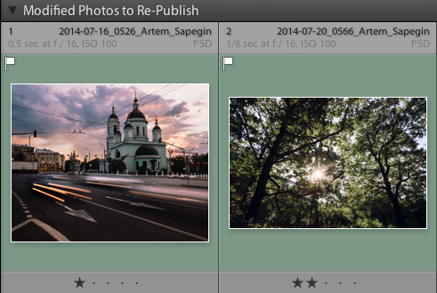

Я покажу, как настроить экспорт фотографий каждым из способов на примере сохранения на диск.

### Export

Открываем File — Export (Cmd+Shift+E) и выбираем подходящий пресет в списке слева или нажимаем кнопку Add.

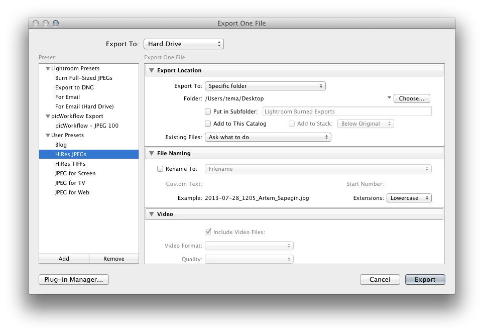

Из списка Export To вверху нужно выбрать Disk, а все остальные параметры настроить по своему вкусу: тип и имя файла, размер, повышение резкости, сохранение метаданных и тому подобное. Про раздел Watermarking мы поговорим в следующем разделе.

Чтобы экспортировать фотографии, нужно их выделить в модуле библиотеки или на панели миниатюр, а потом сделать одно из трёх действий:

* Снова открыть File — Export, выбирать подходящий пресет и нажать кнопку Export. Это способ сложнее следующих двух, но позволяет изменить параметры экспорта.

* Выбрать нужный пресет из меню File — Export with Preset.

* Выбрать File — Export with Previous. Так фотографии будут экспортированы с параметрами предыдущего экспорта.

Точно так же можно экспортировать фотографию, открытую в модуле проявки.

### Publish Services

Публикацию настроить несколько сложнее. Нажимаем кнопку с плюсом в заголовке панели Publish Services (на левой панели модуля библиотеки), и выбираем там Go To Publishing Manager. Дальше — кнопка Add. В появившемся окне выбираем сервис (нам нужен Hard Drive) и вводим имя пресета. После этого откроется такое же окно настроек, как при экспорте.

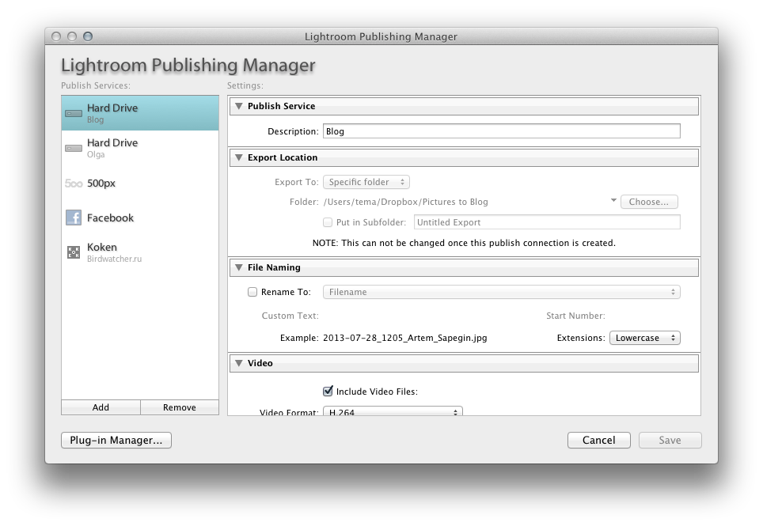

Чтобы экспортировать фотографии, нужно их выделить, и перетащить на нужную коллекцию на панели Publish Services.

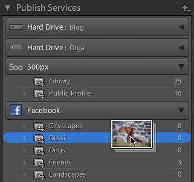

На каждый сервис (диск, Фейсбук, Фликр и так далее) Лайтрум создаёт отдельную группу на панели Publish Services.

Некоторые сервисы (например, Фейсбук) позволяют создавать внутри группы несколько коллекций, публикующих фотографии, например, в разные альбомы Фейсбука. Чтобы добавить такую коллекцию, нужно в контекстном меню заголовка группы выбрать Create Collection.

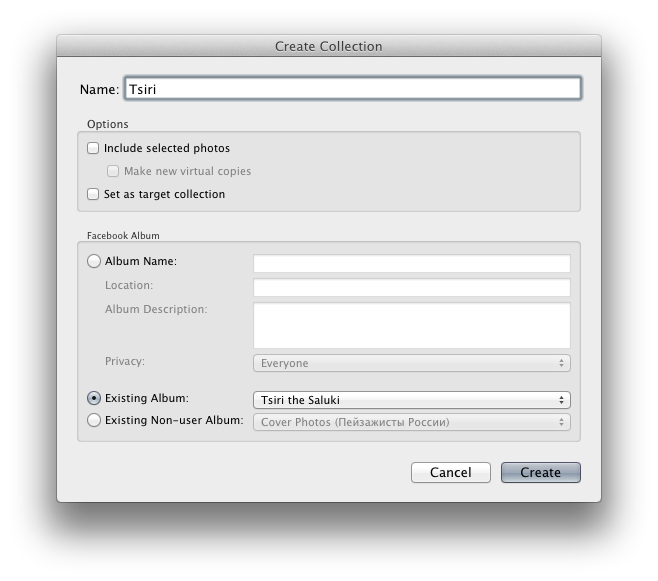

Для других сервисов (например, для диска) нужно создавать отдельную группу.

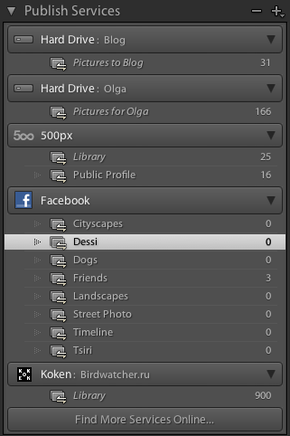

### Публикация фотографий на фотосайтах и социальных сетях

Я использую плагины экспорта фотографий из Лайтрума на Фейсбук (встроенный) и [500px](http://500px.com/lightroom). Есть и множество других плагинов: посмотрите, например, [каталог на сайте Адоби](https://creative.adobe.com/addons?pp=pslr), [плагины Джефри Фридла](http://regex.info/blog/lightroom-goodies) или [Photo Upload](http://www.newpproducts.com/?page_id=3306).

### Загрузка фотографий на сайт

Даже на свой сайт (на движке [Koken](http://koken.me/)) я загружаю фотографии прямо из Лайтрума с помощью [официального плагина](https://store.koken.me/lightroom/koken-publish-service).

Для блогов на WordPress есть плагин [LR/Blog](http://www.photographers-toolbox.com/products/lrblog.php).

## Добавление подписи и рамки

Сам я уже давно не добавляю на свои фотографии ни подписей, ни рамок, но руки ещё помнят, как делать это в Лайтруме.

### Водяные знаки (Watermark)

Простую подпись можно добавить с помощью встроенных водяных знаков (Lightroom — Edit Watermarks, на Виндоусе: Edit — Edit Watermarks).

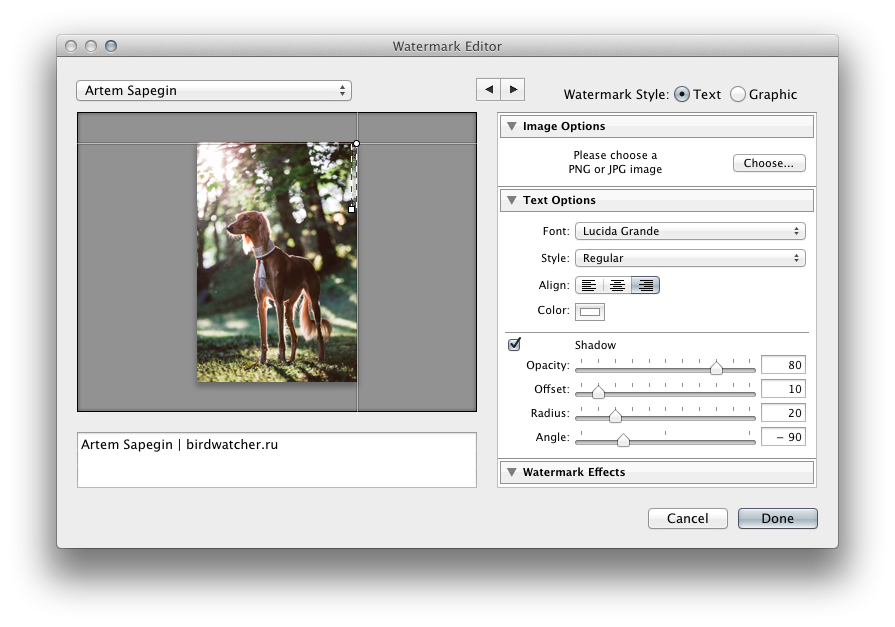

Здесь можно задать текст, положение надписи, шрифт и другие параметры. Однако все размеры задаются относительно размера экспортируемого изображения, и очень трудно подобрать их так, чтобы подпись выглядела аккуратно.

Чтобы сохранить созданный пресет подписи, нужно выбрать в списке пресетов в левом верхнем углу Save Current Settings as New Preset. Теперь этот пресет можно будет выбрать при экспорте или публикации в разделе Watermarking.

### Плагин LR/Mogrify

Наверное, самый удобный и мощный способ добавлять подписи и рамки в Лайтруме — плагин LR/Mogrify.

Сначала нужно [скачать](http://www.photographers-toolbox.com/products/lrmogrify2.php) и установить (см. главу «Подготовка») плагин. На Виндоусе так же нужно установить [ImageMagick](http://www.imagemagick.org/script/binary-releases.php#windows).

Теперь в окне экспорта (File — Export) появился список Post-Process Actions. В группе LR/Mogrify 2 находятся все возможности плагина: добавление рамок, подписей, изменение размеров, повышение резкости

Выберите в списке нужное действие и нажмите Insert (или два раза кликните его название).

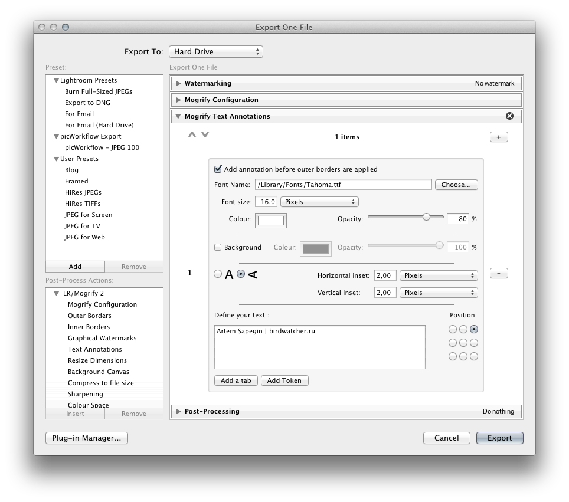

Аналогично добавляются рамки.

Возможностей у плагина очень много, и подробное описание плагина заняло бы полкниги, поэтому лучше смотрите [руководство на сайте](http://www.photographers-toolbox.com/products/lrmogrify2.php?sec=quickguide).

### Другие способы

Если хочется чего-то необычного, то вот два более экзотических способа добавления подписей и рамок:

* [Печать в файл](http://digital-photography-school.com/output-from-lightroom-to-your-blog/).
* [Использование дроплетов Фотошопа](http://thecameraforum.com/droplets-photoshop-automation-lightroom/).

## Работа с архивом

Структуру и бэкап архива мы подробно рассматривали в главе «Подготовка». Теперь поговорим о том, как фотографии туда попадают.

### Перенос фотографий в архив

После завершения обработки я вручную переношу съёмку в архив.

Съёмки, которые мне могут потом понадобиться, я переношу так:

1. Переношу папку съёмки в подходящую папку архива.

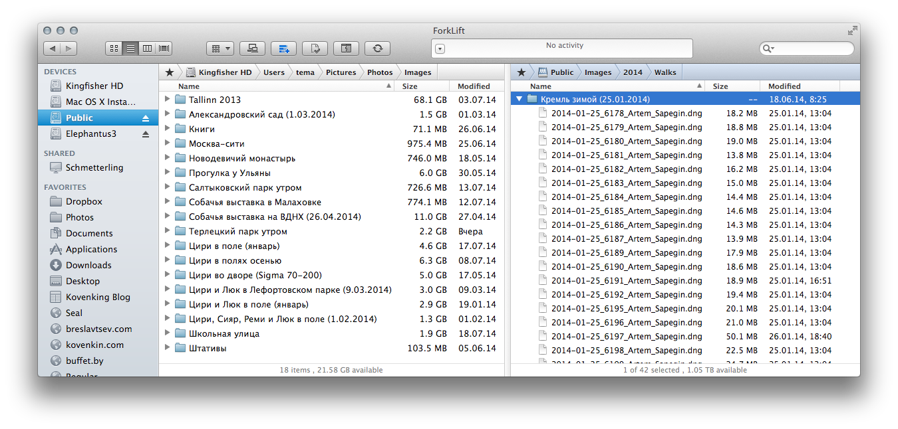

2. Показываю Лайтруму новое местоположение съёмки (правый клик по папке — Find Missing Folder).

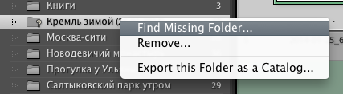

Так фотографии остаются в каталоге, у них сохраняются миниатюры и возможность поиска.

А семейноальбомные и другие неважные съёмки вот так:

1. Экспортирую съёмку как каталог в папку съёмки на диске: правый клик по папке на левой панели — Export this Folder as a Catalog.

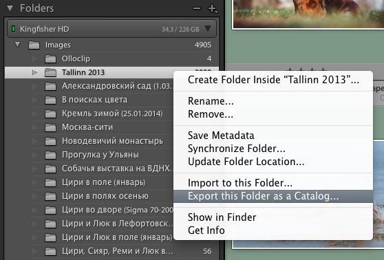

Тут нужно снять первый чекбокс (Export negative files — равы мы перепишем сами), а два других поставить по желанию.

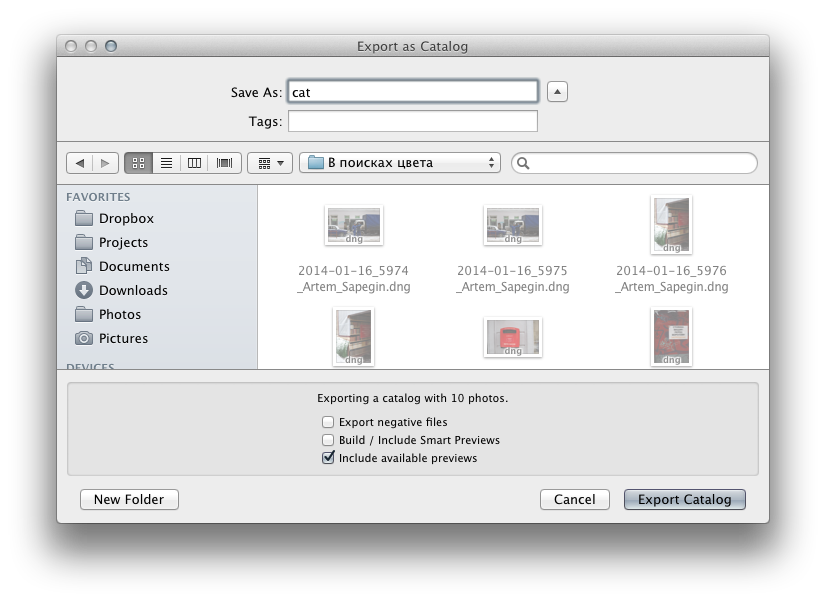

2. Переношу папку съёмки в подходящую папку архива.

3. Удаляю папку из каталога (правый клик по папке — Remove). 

Не забывайте сразу после переноса съёмок в архив делать бэкап архива.

### Работа с фотографиями из архива

Если вы удалили папку из каталога, а она вам понадобилась, то есть два способа поработать с такими фотографиями:

* Открыть каталог съёмки в Лайтруме вместо основного (File — Open Catalog).

* Импортировать каталог съёмки из архива в основной каталог (File — Import from Another Catalog).

Первый способ удобен, если вам нужно поработать с архивной съёмкой совсем чуть-чуть. В остальных случаях удобнее иметь съёмку в основном каталоге, чтобы не переключать каталоги.

### Умные миниатюры

Если на вашем рабочем диске мало места, а вам нужно работать с большим количеством фотографий без доступа к архивному диску, можно сгенерировать для этих фотографий умные миниатюры (smart previews).

Умная миниатюра — это уменьшенный рав-файл (2540 пикселей по длинной стороне), который позволяет использовать любые возможности Лайтрума для его проявки без доступа к исходному файлу. Каждая умная миниатюра занимает всего лишь около мегабайта на диске независимо от объёма исходного рав-файла (например, для моего Canon 6D — примерно 25 МБ).

Генерируются умные миниатюры так: Library — Previews — Build Smart Previews. После этого под гистограммой появится надпись Original + Smart Preview:

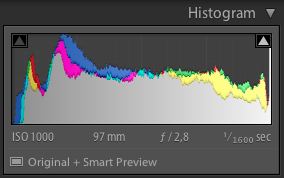

А если отключить диск с исходным файлом, то она сменится на Smart Preview.

Доступ к исходным файлам понадобится, если вы захотите просмотреть фотографию в большом масштабе или экспортировать её в размере большем, чем размер умной миниатюры.

### Поиск по архиву

#### Поиск по каталогу Лайтрума

Если вы не удаляли съёмки из основного каталога, то у вас есть все возможности поиска и фильтрации Лайтрума — это одна из причин, почему стоит держать все фотографии в едином каталоге.

Перед поиском не забудьте выбрать в верхней части левой панели All Photographs, чтобы искать по всему каталогу, а не по выбранной съёмке.

Теперь нажмите Cmd+F (Library — Find) и введите ключевое слово (если вы добавляете ключевые слова к своим фотографиям) или выберите любые другие критерии отбора — это тот же фильтр, что мы рассматривали в главе «Отбор», только область его действия — весь каталог, а не отдельная съёмка.

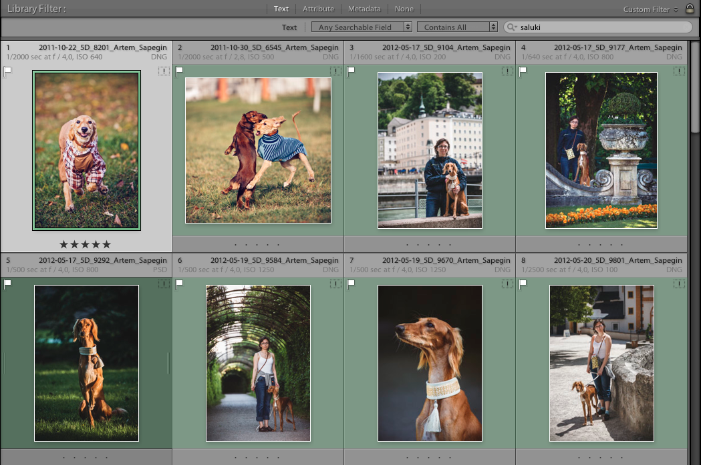

Обратите внимание на иконку с восклицательным знаком в правом верхнем углу каждой миниатюры — я пишу этот текст сидя в кафе, и у меня нет доступа к сетевому диску с архивом, но все возможности поиска и просмотра фотографий остались, можно даже просматривать фотографии во весь экран.

#### Поиск по диску

Если вы удалили фотографии из каталога Лайтрума при перемещении их в архив, то возможностей поиска будет гораздо меньше.

К сожалению, встроенный в операционные системы поиск не умеет читать метаданные в рав-файлах (***виндоус?***), поэтому остаётся только поиск по имени файла.

Но и на этом сложности не заканчиваются. Если фотографии находятся на сетевом диске, то обычный поиск операционной системы их не найдёт (***виндоус?***). В этом случае я использую [Toucan Search](https://itunes.apple.com/us/app/toucan-search/id427105394?mt=12&at=11lSmP) (для мака) — он очень быстро ищет файлы на любых дисках, в том числе сетевых.

### Отбор фотографий из архива

Иногда бывает нужно отобрать какие-то фотографии из всего архива: на выставку, в календарь или на конкурс. Для этого в Лайтруме есть коллекции. Мы уже научились пользоваться быстрыми коллекциями в главе про отбор. Обычные коллекции — это то же самое, но им можно задавать имена.

Коллекции удобны тем, что, при попадании туда, фотография не копируется: в коллекцию помещается ссылка на фотографию. Можно спокойно удалять фотографии из коллекций — исходные файлы никуда не денутся. А одну и ту же фотографию можно добавлять в любое количество коллекций.

Чтобы создать коллекцию, нажмите кнопку с плюсом в заголовке панели Collections и выберите Create Collection.

#### Добавление фотографий в коллекцию

Самый простой способ: просто перетащите снимок из библиотеки в коллекцию.

Но удобнее сделать коллекцию целевой: Set as Target Collection в контекстном меню коллекции. Справа от названия коллекции появится плюс:

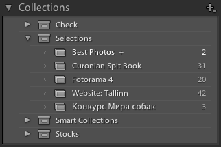

Теперь можно добавить фотографии в эту коллекцию одним из двух способов:

* Add to Target Collection в контекстном меню фотографии или клавиша B. Повторное нажатие удалит фотографию из коллекции.

* Распылителем (как его использовать — см. в главе «Отбор»). Выберите Target Collection в списке Paint.

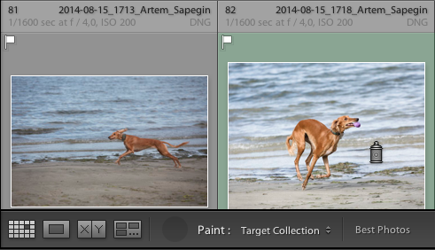

Вы, наверное, заметили, что работа с коллекциями почти не отличается от работы с быстрой коллекцией, которую мы рассматривали в главе про отбор. Так и есть: по умолчанию Лайтрум считает быструю коллекцию целевой (и честно показывает плюс рядом с её названием). Чтобы снова сделать быструю коллекцию целевой выберите File — Set Quick Collection as Target или Set as Target Collection в контекстном меню быстрой коллекции.

### Умные коллекции

Кроме обычных коллекций в Лайтруме есть умные коллекции (smart collections). Умные коллекции содержат не добавленные вручную фотографии, а отобранные по заданным в настройках коллекции критериям. Получается помесь коллекции и фильтра.

Например, можно сделать коллекцию фотографий, которые вы ещё не успели или забыли обработать: то есть у них стоит флаг, но не стоит зелёная метка.

Чтобы создать умную коллекцию, нажмите кнопку с плюсом в заголовке панели Collections и выберите Create Smart Collection. Теперь нужно добавить условия как показано на картинке:

Кроме необработанных фотографий, у меня есть коллекция отвергнутых (rejected) фотографий (которые я забыл удалить) и коллекции фотографий с неполными метаданными:

### Работа с фотобанками

***…***

### Ключевые слова

Ключевые слова — очень сложная тема, которая требует немалых трудозатрат как на первичное создание словаря, так и на выбор ключевых слов для всех фотографий. Именно поэтому я пишу об этом в самом конце книги. Однако, это не уменьшает важности ключевых слов: только так вы сможете легко находить любые ваши фотографии.

Я несколько раз пытался начать использовать ключевые слова, и до сих пор не уверен, что последняя попытка окажется удачной.

Есть два способа работы с ключевыми словами:

* Для каждой фотографии вы сочиняете ключевые слова с нуля.

* Вы используете или создаёте иерархический список ключевых слов и выбираете слова из него.

У второго способа есть много плюсов: 

* Иерархия списка будет подсказывать, какие ключевые слова нужно добавить: где снята фотография, что на ней изображено и так далее.

* Добавляя слово из глубины иерархии, добавляются и все слова, в которые вложено выбранное: животное — собака — такса — длинношёрстная такса.

* У ключевых слов могут быть синонимы, которые будут добавляться вместе с основным словом.

* Некоторые ключевые слова можно сделать неэкспортируемыми, то есть они могут использоваться только внутри каталога Лайтрума. Это удобно для группировки ключевых слов (например, нет смысла экспортировать слова вроде «место съёмки») и для создания служебных ключевых слов (см. раздел про работу с фотобанками).

* Использование списка не исключает как ручной ввод ключевых слов уже содержащихся в списке, так и добавление в него новых (при этом необходимо найти новому слову место в иерархии).

Есть много платных (например, [Controlled Vocabulary](http://www.controlledvocabulary.com/products/lightroom.html), [Keyword Catalog](http://www.keyword-catalog.com/), [Photo-Keywords](http://www.photo-keywords.com/), [D-65](http://www.d-65.com/downloads.html)) и несколько бесплатных списков ключевых слов. Кроме общих списков есть и тематические (например, виды животных определённого региона). Я сделал свой иерархический список на основе бесплатного [Lightroom Keyword List Project](http://lightroom-keyword-list-project.blogspot.gr/).

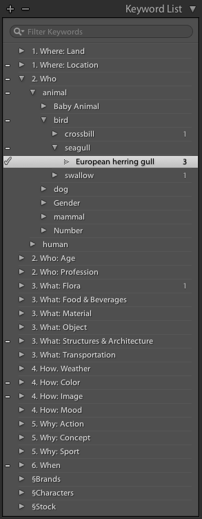

Не обязательно сразу создавать максимально полный список на все случаи жизни. Достаточно продумать структуру и создать основные ключевые слова, а потом дополнять список по мере необходимости.

Чтобы создать новое ключевое слово, нужно в контекстном меню панели Keyword List выбрать Create Keyword Tag (или Create Keyword Tag Inside…, чтобы создать ключевое слово, вложенное в уже существующее).

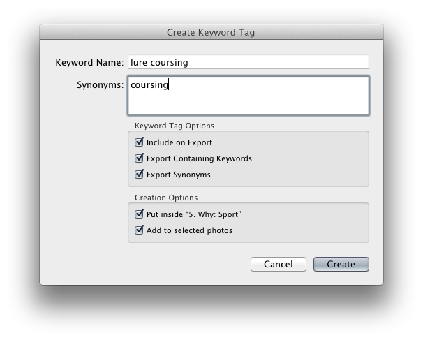

Первые два чекбокса стоит пояснить, а значение остальных понятно из их названий:

* Include on Export: нужно ли экспортировать ключевое слово. Полезно снимать у заголовков групп (например, «1. Where: Location») и служебных ключевых слов.

* Export Containing Keywords: нужно ли экспортировать вложенные ключевые слова. Удобно для технических ключевых слов, используемых для группировки фотографий, но не имеющих смысла за пределами Лайтрума (см. раздел «Работа с фотобанками»).

Чтобы добавить ключевые слова, нужно выделить одну или несколько фотографий, и включить чекбоксы напротив нужных ключевых слов:

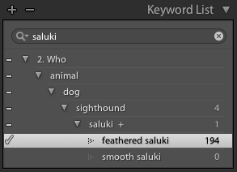
