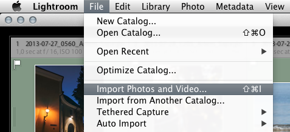
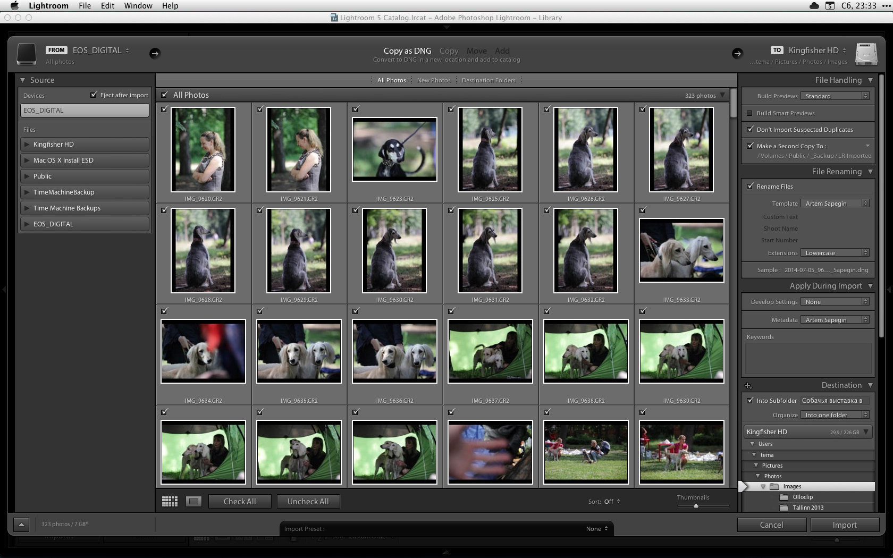
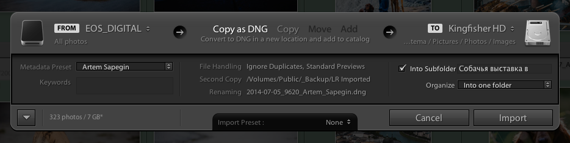
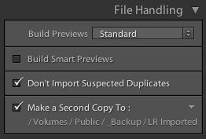
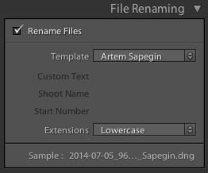
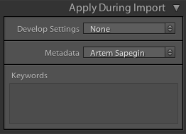
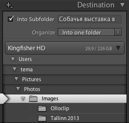
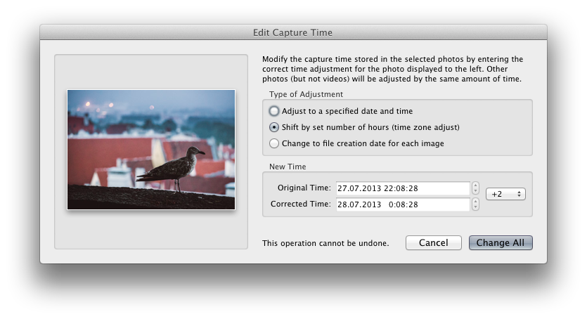

# Импорт

Чтобы начать работать с фотографиями в Лайтруме, нужно их в него импортировать.

Я импортирую в Лайтрум все фотографии, а уже потом начинаю их отбирать. Для отбора я использую только Лайтрум. Многие фотографы используют другие программы для отбора фотографий, но мне такой подход кажется непродуктивным: Лайтрум может показаться медленнее других программ (таких как Photo Mechanic), но более простой процесс в итоге оказывается быстрее.

Удобнее всего импортировать фотографии прямо с флешки: вставляете флешку в кардридер, открываете File — Import Photos and Video (Cmd+Shift+I):

И видите вот такое развесистое окно:

Или вот такое маленькое:

Переключаться между кратким и полным видом можно кнопкой со стрелкой в левом нижнем углу окна импорта.

В списке слева выбираете вашу флешку, а сверху — Copy as DNG или Copy. Я всегда конвертирую рав-файлы в DNG (см. далее «Формат DNG»).

В центральной области можно отметить нужные файлы (если хотите импортировать не всё).

Самое интересное в правой колонке. Многие параметры должны быть вам уже знакомы — в предыдущей главе я рассказывал как создавать пресеты имён файлов и метаданных.

1. Render Previews — создание миниатюр при импорте. Я всегда выбираю Standard. Такие миниатюры подходят для просмотра во весь экран (в настройках должен быть задан соответствующий размер — см. предыдущую главу) и первичного отбора, и их генерация занимает меньше времени, чем генерация полноразмерных (1:1) миниатюр.

2. Build Smart Previews — создание умных миниатюр. Умные миниатюры позволяют работать с фотографиями, находящимися на отключенных внешних дисках. Они занимают гораздо меньше места, чем исходные рав-файлы и позволяют использовать все инструменты модуля проявки (Develop). Исходные файлы потребуются только для просмотра в масштабе 1:1 и экспорта файлов в большом размере. Если вы собираетесь хранить рабочие файлы на внешнем диске, ставьте этот чекбокс: Лайтрум будет работать гораздо быстрее, но и места на внутреннем диске вашего компьютера понадобиться больше.

3. Don’t Import Suspected Duplicates — Лайтрум не будет повторно импортировать файлы, которые уже есть в каталоге. Например, если вы второй раз вставите одну и ту же флешку, то импортированы будут только новые файлы, если они есть.

4. Make a Second Copy To — бэкап исходных файлов в другую папку (а лучше — на другой диск). Позволяет сразу после импорта получить необходимые две копии фотографий на разных дисках. Имейте ввиду, что это бэкап на крайний случай: в него попадают все фотографии до отбора, и складываются в папки вида «Imported on 5 июня 2014 г» — не очень-то легко будет найти нужную съёмку. Так что это не замена полноценному бэкапу, а небольшое дополнение. Дома я использую папку на сетевом диске с фотоархивом; а в поездках — папку на внешнем диске.

5. Rename Files — переименование файлов. Если все фотографии нужно переименовать одинаково (в моём случае — если у них один автор), то я просто выбираю нужный пресет имён файлов. Если имена нужны разные, то лучше отложить переименование — Лайтрум не всегда правильно переименовывает файлы по второму разу.

6. Develop Settings — пресет проявки, который будет применён для всех импортируемых фотографий. Я всегда выбираю None, то есть настройки по умолчанию (их тоже можно поменять — см. главу «Проявка»).

7. Metadata — метаданные. Копирайт, автор и тому подобное. Я всегда выбираю пресет со своими данными. Даже если авторов было несколько, потом несложно будет выбрать другой пресет для нужных фотографий.

8. Keywords — ключевые слова, общие для всех фотографий. Если вы упорный, то можете забить сюда общие для всех фотографий ключевые слова: место съёмки, имя модели — всё, что поможет вам найти в каталоге нужные фотографии. Я обычно добавляю ключевые слова после обработки — см. главу «Экспорт и архивирование».

9. Destination — папка, куда будут скопированы файлы. Я всегда делаю так, как показано на скриншоте: выбираю в нижнем списке папку с фотографиями, а в поле Into Subfolder пишу имя съёмки. Если в списке Organize выбрать By date, Лайтрум будет создавать отдельные папки для каждого года, месяца или числа (вдруг это кому-то нужно).

## Формат DNG

Настоящая цифровая фотография начинается со съёмки в рав. Половина мощи Лайтрума именно в проявке рав-файлов. И тут перед вами встаёт выбор: оставлять рав-файлы как есть (а у каждой камеры формат свой — CR2, NEF, ORF и множество других) или конвертировать в родной для Лайтрума формат DNG.

DNG (Digital NeGative) — это открытый формат рав-файлов, придуманный компанией Адоби. Надеюсь, когда-нибудь все камеры будут снимать сразу в DNG, но пока таких мало.

Сконвертировать рав-файлы в DNG можно как при импорте в Лайтрум, так и после (Library — Convert Photo to DNG). А так же отдельной бесплатной утилитой [Adobe DNG Converter](http://www.adobe.com/support/downloads/product.jsp?product=106&platform=Mac).

Я конвертирую в DNG все рав-файлы при импорте в Лайтрум.

Плюсы DNG:

1. Меньший объём: DNG на 10—15% меньше родных форматов.

2. Нет необходимости хранить метаданные в отдельных XMP-файлах (подробнее в предыдущей главе) — вся необходимая информация сохраняется в самих DNG-файлах.

2. Проприетарные рав-форматы недокументированы и их поддержка в будущем может прекратиться. Вряд ли это случится с форматами Кенона и Никона, но с менее популярными камерами это вполне вероятно. DNG — формат полностью документированный и открытый. Любой разработчик может реализовать полностью совместимый с ним конвертер.

3. Файлы открываются гораздо быстрее (если включить в настройках Embed Fast Load Data).

4. DNG-файлы содержат данные, позволяющие определить повреждения файлов. Чтобы проверить ваши файлы: Library — Validate DNG Files.

Минусы:

1. Конвертация занимает довольно много времени, но это нужно сделать только один раз.

2. Теряется возможность использовать родные (от производителей камер) рав-конвертеры — они поддерживают только те форматы, в которые снимают камеры этого производителя. Неродные конвертеры (такие как CaptureOne или Apple Photos) поддерживают DNG.

## Пресеты импорта

Все параметры окна импорта можно сохранить как пресет. Это удобно, если вы используете разные параметры: пресеты позволят вам быстро переключаться между ними.

Чтобы сохранить текущие параметры как пресет, нужно выбрать в списке Import Preset внизу диалога Save Current Setting as New Preset.

## Изменение часового пояса

Я часто забываю менять время в камере при переезде в место с другим часовым поясом. Лайтрум позволяет сдвигать время съёмки для всех выделенных фотографий на необходимое количество часов. 

Для этого нужно выбрать Metadata — Edit Capture Time и в списке Type of Adjustment выбрать Shift by set number of hours (time zone adjust).

