# Подготовка к работе

## Обзор интерфейса

Интерфейс Лайтрума состоит из семи *модулей*:

* Library — библиотека. Здесь можно просматривать и отбирать фотографии, искать и фильтровать их по разным параметрам.

* Develop — проявка. Пожалуй, главный модуль: именно здесь вы обрабатываете (проявляете) фотографии.

* Map — карта. Показывает, где были сделаны ваши фотографии, если в вашей камере уже есть GPS, и позволяет привязать их к местам на карте, если нет.

* Book — вёрстка фотокниг, которые можно экспортировать в PDF или закачивать на Blurb для печати через интернет.

* Slideshow — создание слайдшоу с музыкой и сохранением видео или PDF.

* Print — печать фотографий.

* Web — создание HTML-галерей.

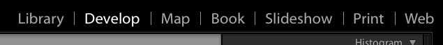

Между модулями библиотеки и проявки можно быстро переключаться с помощью клавиатуры: Library — G (от слова Grid), Develop — D.

Большую часть окна занимает рабочая область, содержимое которой зависит от выбранного модуля: это могут быть миниатюры, большая фотография, карта и так далее.

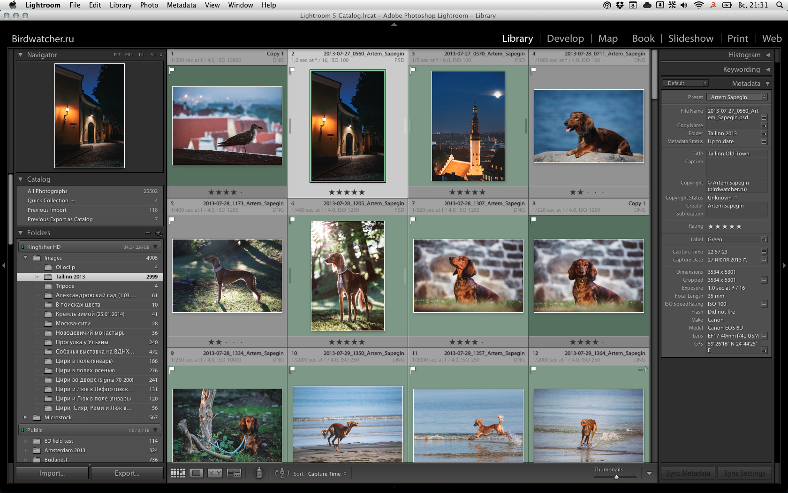

Слева и справа находятся панели, их состав тоже зависит от текущего модуля. Группы панели (левую и правую, а так же шапку со списком модулей и панель с миниатюрами внизу) можно скрывать и показывать, нажимая край группы панелей с белым треугольником. Клик по краю правой клавишей мышки открывает меню, где можно включить автоскрывание панелей. Стоит попробовать разные варианты скрывания панелей. У меня почти везде выбрано ручное скрывание (Manual), но автоматическое (Auto Hide & Show) иногда бывает удобным.

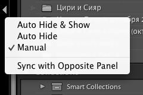

Отдельные панели можно сворачивать и разворачивать, нажимая на заголовок. А правый клик по заголовку открывает меню, где можно совсем убрать ненужные панели или включить режим одной панели (Solo), когда при разворачивании одной панели в группе, все остальные будут сворачиваться. Я никогда не пользуюсь режимом одной панели, мне он кажется непродуктивным: всё время нужно разворачивать панели. Все нужные мне панели у меня всегда развёрнуты и находятся под рукой.

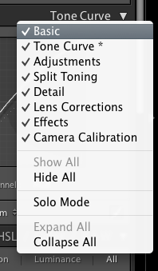

И последний элемент интерфейса, который есть во всех модулях, — панель инструментов (View — Show Toolbar; T). В ней можно настроить текущий инструмент или экран.

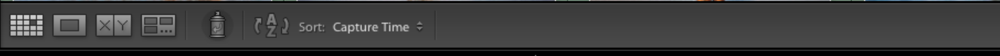

## Настройка

### Общие настройки

Выберите в меню Lightroom — Preferences (на Windows: Edit — Preferences).

Не буду рассказывать про все настройки — их слишком много; рассажу только про самый важные.

#### General

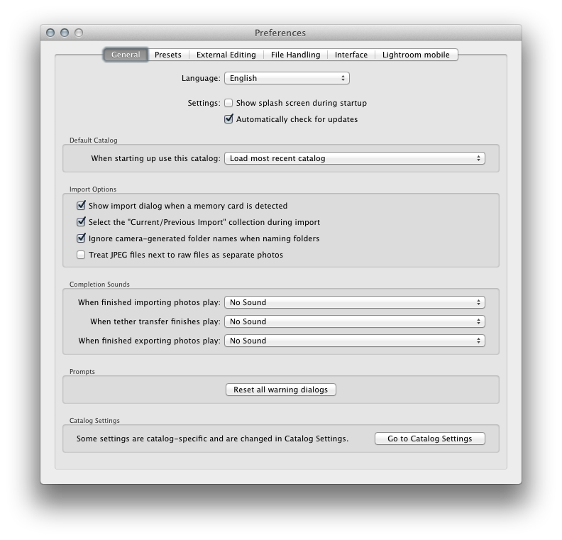

#### Presets

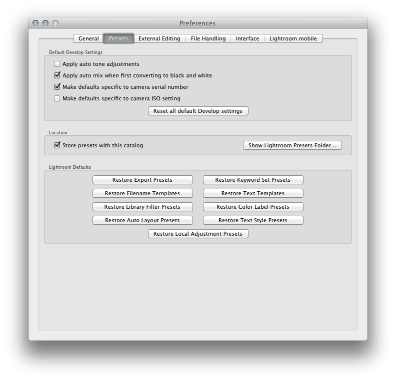

Apply auto tone adjustments — автоматически настраивать экспозицию, контраст и значения Highlight/Shadows/Whites/Blacks. Для меня лучше работает выставление фиксированных значений экспозиции и контраста в пресете проявки по умолчанию (см. дальше).

Make defaults specific to camera serial number: если у вас нескольк камер, то у каждой будет свой пресет по умолчанию.

Make defaults specific to camera ISO setting: то же самое, но для значения чувствительности. Должно быть полезно для сильно шумящих камер, чтобы ставить разные значения шумоподавления для разных ISO.

Store presets with this catalog: сохранение пресетов в папке каталога. Так горадо удобнее их бэкапить или переносить на новый компьютер.

#### External Editing


Stack with original: после завершения редактирования в Фотошопе (или другом редакторе) отредактированный файл будет объединён в группу с исходным рав-файлом.


Edit externally file naming: по умолчанию Лайтрум при передаче во внешний редактор добавляет к имени файла суффикс _Edit. Мне это кажется лишним, поэтому я выбрал шаблон (список Template) Filename — то есть оставлять исходное имя файла.

#### File Handling

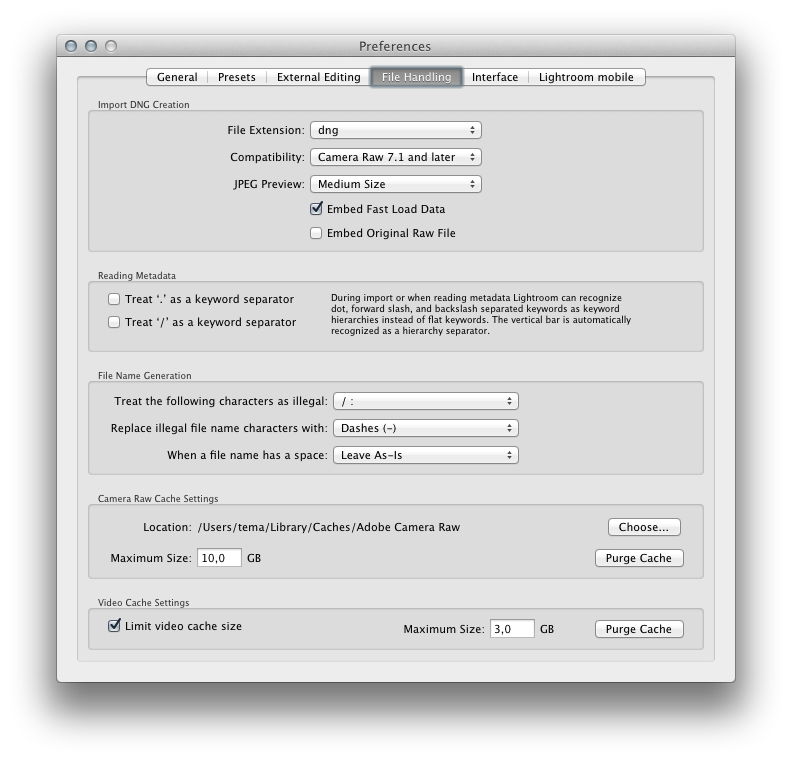

Embed fast load data: Лайтрум будет включать в DNG-файлы информацию для их быстрой загрузки. По обещаниям Адоби — аж в восемь раз.

Camera Raw cache settings: желательно увеличить размер кэша хотя бы до 3 ГБ.

#### Interface

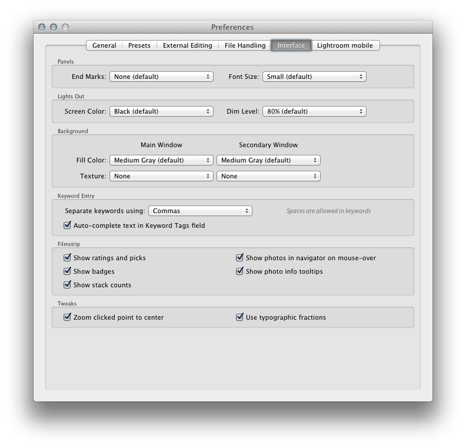

### Настройка каталога

Выберите в меню Lightroom — Catalog Settings (на Windows: Edit — Catalog Settings).

#### General

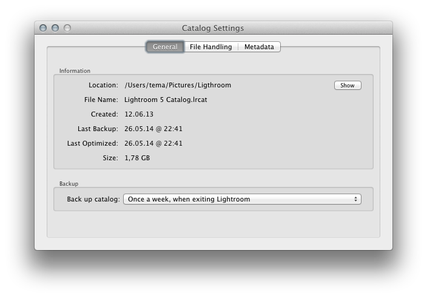

Back up catalog: создание резервных копий каталога. Я выбрал раз в неделю при закрытии Лайтрума. Раз в неделю Лайтрум будет предлагать сделать бэкап каталога:

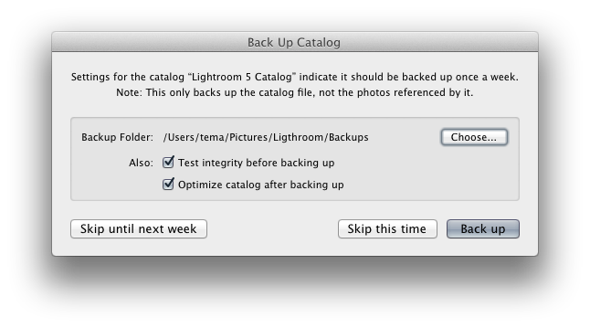

В этом окне можно поменять папку, куда будет сохранён бэкап. Заодно стоит поставить обе галочки под заголовком Also: Test integrity before backing up (проверять целостность каталога перед созданием бэкапа) и Optimize catalog after backing up (оптимизировать каталог после создания бэкапа).

Если нажать кнопку Skip this time, то запрос на создание бэкапа опять появится при следующем закрытии Лайтрума.

К сожалению, Лайтрум не умеет сам удалять старые бэкапы, и папка с бэкапами быстро растёт в объёме. Поэтому иногда нужно заходить в неё и удалять все старые бэкапы, оставляя 1—2 последних.

#### File Handling

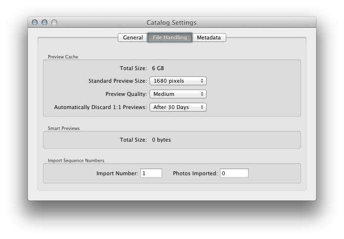

Standard preview size: размер стандартных миниатюр. Должен быть больше или равен разрешению экрана.

Preview quality: качество миниатюр. На мой взгляд среднего (Medium) вполне достаточно. Актуально только для модуля Library;  в модуле Develop фотография перерисуется в максимальном качестве.

Automatically discard 1:1: previews: автоматически удалять полноразмерные миниатюры. Так как они нужны в основном только для отбора, то нет смысла хранить их вечно. Месяца вполне достаточно на отбор съёмки. А если будет мало, то не проблема создать их снова.

#### Metadata

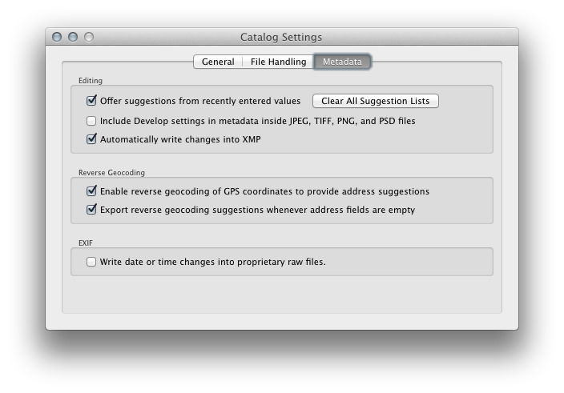

Automatically write changes into XMP. По умолчанию Лайтрум хранит все метаданные фотографий (параметры отбора, проявки, ключевые слова и всё остальное) в каталоге. Удобнее когда все параметры хранятся рядом с файлами. Это позволяет не зависеть от каталога и его целостности (мало ли что) — вы всегда сможете восстановить работу, проделанную в Лайтруме. Так как Лайтрум никогда не изменяет исходные рав-файлы (если это не DNG), то параметры записывают в файлы формата XMP с такими же именами, как у рав-файлов.

### Настройка среды / Параметры просмотра

Если у вас в Лайтруме ещё нет ни одной фотографии, то придётся отложить этот раздел до импорта первой съёмки.

Выберите в меню View — View Options. Здесь можно настроить интерфейс просмотра миниатюр (Grid View) и просмотра одной фотографии (Loupe View).

Тут стоит просто понажимать все галочки и посмотреть, как будет меняться интерфейс.

Ещё два параметра настраиваются в самом модуле Library, на панели инструментов (нажмите T, если её не видно): сортировка и размер миниатюр.

Сортировка:

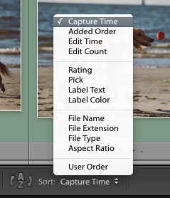

У Лайтрума есть одна дурацкая особенность: если вы случайно передвините одну из миниатюр, то Лайтрум включит пользовательский режим сортировки (User Order), вместо того, который вам на самом деле нужен (у меня это всего время съёмки — Capture Time). Так что менять режим сортировки приходится чаще, чем хотелось бы.

Размер миниатюр:

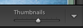

Если вы не видите этих настроек на панели инструментов, нажмите треугольник в её правой части и выберите там нужные пункты:

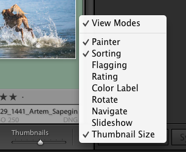

## Полноэкранный режим

Если у вас маленький экран, попробуйте работать в полноэкранном режиме: Window — Screen Mode — Full Screen. Так меню и рамка окна не будут занимать место на экране, при этом меню всегда будет доступно при наведении мышки на верхний край экрана.

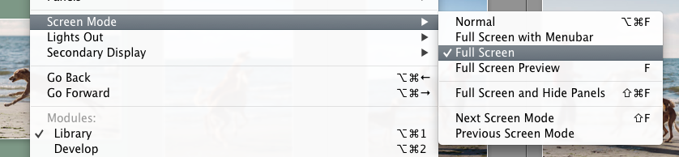

Другая полезная разновидность этого режима — полноэкранный просмотр. Нажмите клавишу F, и выделенная фотография будет показана во весь экран на ровном фоне, а все элементы интерфейса будут скрыты. Это работает как в модуле проявки, так и в библиотеке.

Цвет фона полноэкранного просмотра можно поменять кликнув правой кнопкой мышки в любой части экрана:

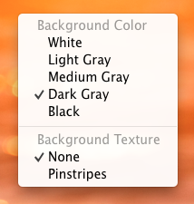

Этот же способ работает и для изменения цвета фона при просмотре фотографий в библиотеке и в модуле проявке.

## Пресеты

Настройки многих инструментов можно сохранять в виде пресетов (preset), чтобы потом можно было выбрать их парой кликов: шаблоны переименования файлов, параметры кистей, настройки проявки фотографии, метаданные и другие. Я использую множество пресетов и они заметно ускоряют работу.

О том, как создавать разные пресеты я буду рассказывать по ходу книги, при описании соответствующих инструментов.

## Горячие клавиши

Многие действия в Лайтруме удобнее делать горячими клавишами, а не через интерфейс. Это, во-первых, быстрее, а, во-вторых, позволяет использовать инструменты, которые не видны на экране (например, находятся на скрытой боковой панели).

Имейте ввиду, что горячие клавиши работают только в английской раскладке клавиатуры.

## Плагины

С помощью плагинов можно расширять функциональность Лайтрума: добавлять экспорт в разные сервисы (500px, Flickr, Facebook), ретушировать портреты (Portraiture), делать фотографии чёрно-белыми (Silver Efex Pro) и так далее.

Часть таких плагинов уже встроены в Лайтрум (например, экспорт на Фейсбук).

Некоторыми из них я научу вас пользоваться в следующих главах книги, а пока можно поотключать лишние плагины — это сделает Лайтрум на 0,1% быстрее и интерфейс будет меньше захламлён ненужными элементами. Откройте File — Plug-in Manager и для всех плагинов, которыми вы не планируете пользоваться, нажмите кнопку Disable в панели Status.

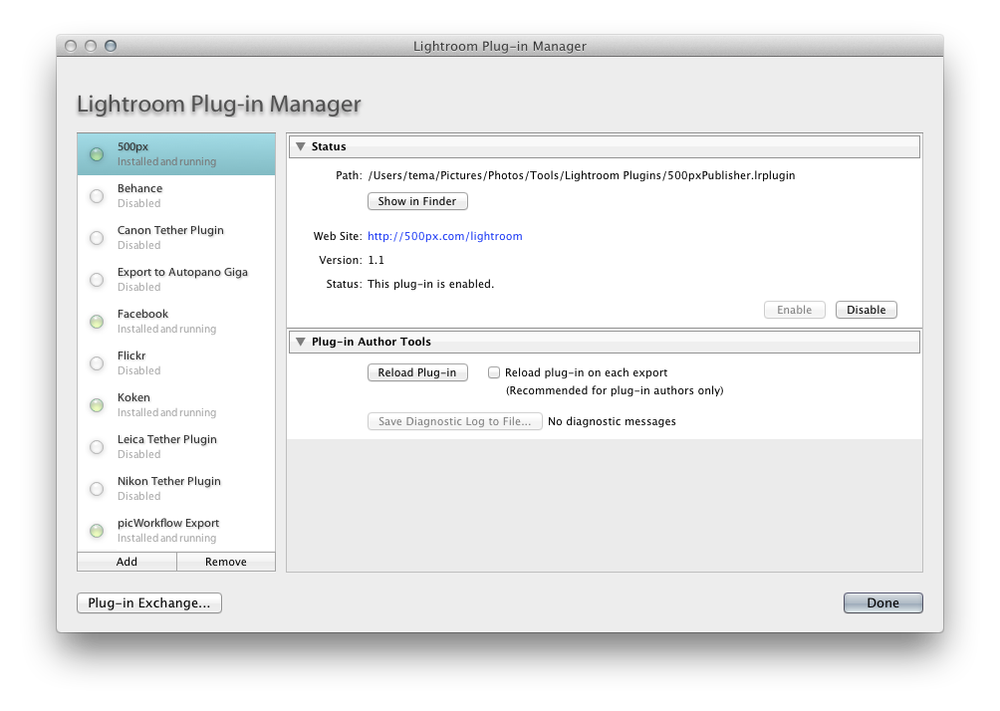

Как видно из скриншота, у меня выключены почти все встроенные плагины.

## Каталоги

Лайтрум, в отличии от многих других программ (например, Adobe Bridge), не позволяет работать с файлами напрямую. Вы не можете просто открыть в нём файл, как в Фотошопе. 

Лайтрум работает с *каталогами*. Каталог — это база данных ваших фотографий. Те папки, что вы видите в левой панели Лайтрума, и есть каталог. Всё, что вы импортируете, попадает туда. Это позволяет Лайтруму очень быстро показывать миниатюры фотографий, находить и фильтровать фотографии.

По умолчанию Лайтрум открывает при запуске каталог, который использовался в прошлый раз. Но можно использовать несколько каталогов. Например, в одном хранить коммерческие съёмки, а в другом — личные. У меня все фотографии хранятся в одном каталоге.

Каталог должен находится на самом быстром диске вашего компьютера (у меня это встроенный в Макбук диск SSD). По умолчанию Лайтрум предложит создать каталог на системном диске — скорее всего именно это вам и нужно.

**Важно**. В каталоге хранятся только ссылки на фотографии, параметры обработки (если используется родной формат рав-файлов и отключено сохранение параметров в XMP-файлы), история обработки и так далее. Сами же фотографии хранятся отдельно. Помните об этом при копировании и бэкапе каталога.

## Структура папок

Я храню фотографии в двух местах:

1. Текущие съёмки (работа над которыми ещё не закончена) на внутреннем жёстком диске моего макбука.
2. Все остальные — в архиве, на сетевом жёстком диске.

На самом деле всё немного сложнее, потому что всё нужно бэкапить, но о бэкапах в книге есть целая глава, а сейчас важно, что внутри этих двух хранилищ.

### Текущие съёмки

Текущих съёмок обычно не слишком много, поэтому структура папок максимально простая: при импорте Лайтрум создаёт для каждой съёмки подпапку в общей папке со всеми теукщими съёмками. Имя съёмки (подпапки) я тоже выбираю простое, но понятное:

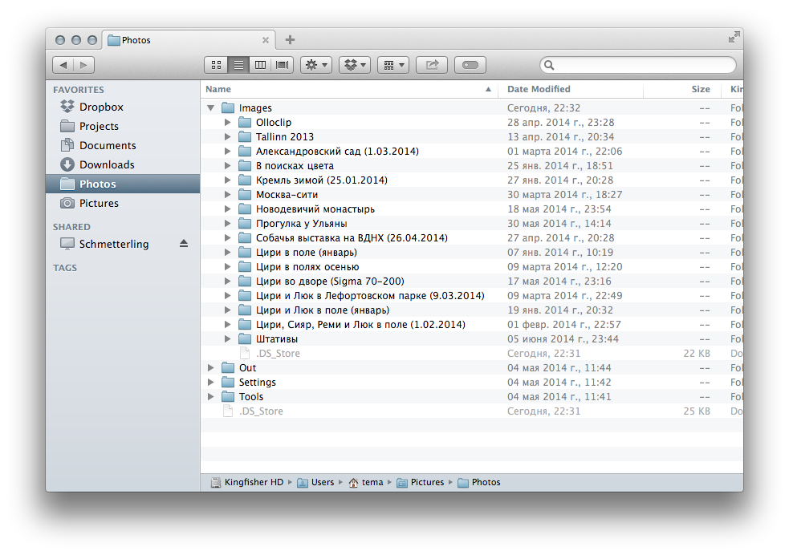

Даты, категории и прочие метаданные в именах папок я не использую. В большинстве случаев они не добавляют понятности, а лишь усложняют и удлиняют имя. Если у вас много похожих съёмок и сложно каждый раз выдумывать новые имена, то дата — простой способ сделать имя уникальным. Но фанатизм тут не нужен: просто добавьте дату в произвольном формате в скобках.

### Архив

Структура папок архива более сложная. И тут может быть много вариантов: в зависимости от того, что вы снимаете и как часто.

У меня структура такая:

```
Год/Тип/Имя съёмки
```

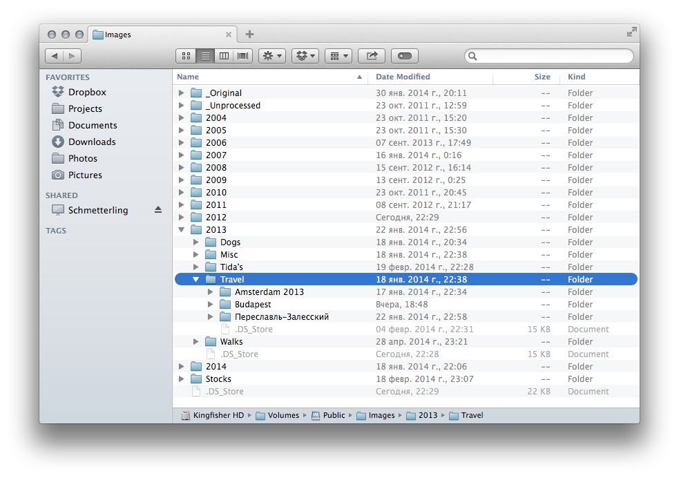

По сравнению с папкой текущих съёмок тут появляется некоторая группировка съёмок: по году и типу (поездки, собаки и другие). Это позволяет быстрее находить нужные съёмки, но и не требует много времени на поддержку.

## Имена файлов

Обычно камеры создают файлы вроде IMG_0666.CR2. Это неудобно, даже если вы снимаете одной камерой: имена получаются неуникальными — камера сбрасывает счётчик каждые 10 000 кадров. Уникальное имя позволяет связывать и быстро находить все форматы одной и той же фотографии: рав, PSD, JPEG…

Сейчас я использую такие имена:

```
2013-07-29_1366_Artem_Sapegin.dng
```

1. Дата съёмки в формате ГГГГ-ММ-ДД, чтобы файлы сортировались по дате.
2. Порядковый номер, присвоенный камерой (тот самый неуникальный).
3. Имя-фамилия.

Если у вас несколько камер, можно добавить в имя файла название камеры (или какой-то идентификатор, если камеры одинаковые), чтобы исключить повторение имён. С одной камерой таких имён достаточно.

Чтобы переименовать файлы, нужно выделить их в модуле Library и нажать Library — Rename Files (F2) и выбрать в списке File Naming один из шаблонов или Edit, чтобы создать новый или изменить один из существующих.

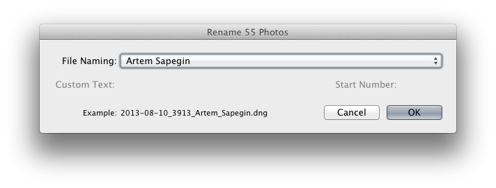

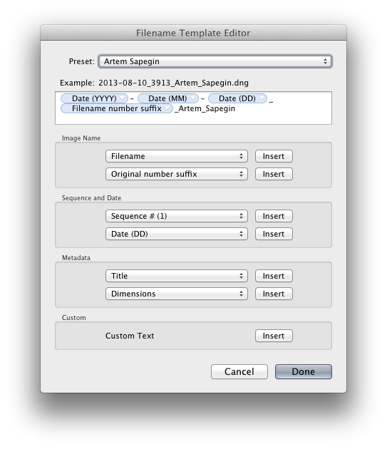

Для сохранения нового шаблона нужно выбрать в списке Preset Save Current Setting as New Preset.

Переименовывать файлы можно при импорте, выбрав нужный шаблон в окне импорта (см. следующую главу).

## Пресет по умолчанию

Если вы делаете какие-то изменения для каждой (или почти для каждой) фотографии, то можете изменить пресет по умолчанию так, чтобы Лайтрум сам применял нужные вам изменения при импорте фотографий.

Для этого нужно открыть в модуле проявки любую ещё не обработанную фотографию. Сделать все нужные изменения, и удерживая Alt, нажать Set Default в самом низу правой панели (там, где до нажатия Alt была кнопка Reset).


У меня выставлены в ноль все параметры, кроме:

Exposure: –0,40.
Contrast: –10.
Clarity: +5.
Saturation: –10.
Point Curve: Medium Contrast (и включаю режим редактирования кривой по точкам — кнопка справа от списка Point Curve).

Отключено повышение резкости (Sharpening — Amount: 0), а шумодав включен только цветовой (Noise Reduction — Luminance: 0, Color: 25/50/50).

В панели Lens Correction стоит чекбокс Remove Chromatic Aberration. А в панели Camera Calibration в списке Profile выбран профиль Camera Standard.


## Пресеты метаданных

Метаданные — это информация о фоторафии, такая как имя автора или город, где была сделана фотография.

Удобно и полезно добавить информацию об авторе фотографии во время импорта так, чтобы она всгеда оставалась в файлах.

Для создания нового пресета метаданных нужно нажать Metadata — Edit Metadata Presets, заполнить все необходимые поля и в списке  Preset выбрать Save Current Setting as New Preset. Имейте ввиду, что пресет перезапишет все поля, отмеченные галочкой, даже если вы их не заполните.

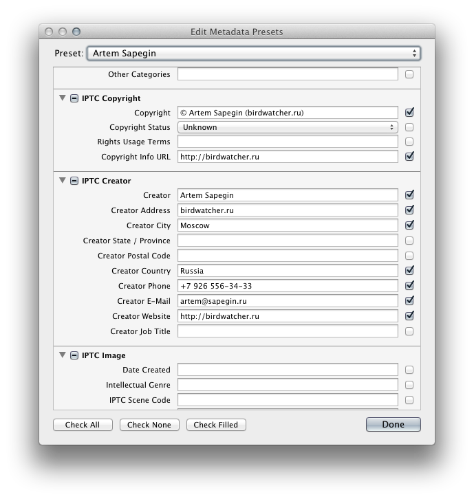

Вы можете так же создать пресеты для городов, где часто снимаете, или других параметров. Это позволит вам применять нужные параметры одним кликом сразу для многих фотографий.

## Хранение фотографий


## Резервные копии

Бэкапы — очень важная тема. Фотографу сложно представить событие хуже потери своих фотографий. Однако, многие никак себя от этого не защищают. Жёсткие диски делятся на два типа: те, что уже умерли, и те, что умрут потом. Если у вас никогда не умирал жёсткий диск, то вам просто повезло, но не стоит рассчитывать, что и дальше будет везти.

Любые ценные данные должны быть как минимум в двух местах: например, на внутреннем диске компьютера и на внешнем диске или на двух внешних дисках. Лишних бэкапов не бывает. Ещё лучше хранить копии в разных местах: например, один диск дома, а другой в офисе. На случай пожара или других неприятностей, когда все копии, хранящиеся в одном месте могут погибнуть.

Фотоархив у меня устроен так:

1. Рабочие файлы на внутреннем диске макбука.
2. Архив на сетевом диске.
3. Бэкап архива на двух внешних USB-дисках.

### Исходные рав-файлы

При импорте фотографии бэкапятся на сетевой диск. Это бэкап на крайний случай — вдруг что-то случиться до того, как завершится очередной бэкап внутреннего диска компьютера. (Подробнее — в главе «Импорт».)

### Каталог Лайтрума

Лайтрум сам неплохо справляется с бэкапом каталога ...

(Подробнее — в главе «Подготовка к работе».)

### Рабочие файлы и система

Внутренний диск моего макбука автоматически бэкапится двумя способами:

* Раз в час на сетевой диск с помощью Time Machine, встроенной в OS X.
* Раз в сутки в интернет с помощью Backblaze. ***Crashplan***

Оба способа хранят историю изменений и позволяют вернуться к предыдущей версии файла в течение некоторого времени.

### Архив

Фотографии с архивного сетевого диска бэкапятся на два внешних USB-диска с помощью [GoodSync](http://www.goodsync.com/).

### Портфолио

Так как я загружаю на свой сайт полноразмерные файлы, то это можно считать дополнительным бэкапом лучших фотографий. Заодно они становятся доступны из любого места: даже если я в отпуске и у меня нет с собой ни диска с архивом, ни даже ноутбука.

### Документы

Dropbox позволяет синхронизировать все ваши документы между несколькими компьютерами, восстанавливать предыдущие версии файлов (мне не раз это пригождалось) и иметь доступ к документам с любого устройства, где установлен Dropbox (например, с айпада).

Таким образом все рабочие и архивные съёмки хранятся в трёх местах.

## Работа в поле

В поездки я беру ноутбук поменьше основного и переписываю фотографии на него. Когда у меня есть свободное время, я отбираю фотографии в дороге. Импорт и отбор ничем не отличаются от «домашних», описанных в следующих главах, но по приезду нужно переписать фотографии и каталог Лайтрума на основной компьютер.

Фотографии переписываются просто — копируем папку с фотографиями  с бэкапного внешнего диска (вы ведь не забываете их делать?) на основной компьютер, туда, где лежат все ваши съёмки.

С каталогом немного сложнее. В Лайтруме на «полевом» ноутбуке нужно экспортировать съёмку как каталог — правый клик по папке в левой панели, а там Export this Folder as a Catalog, и сохраняем его на тот же внешний диск, где у нас уже лежат все фотографии.

Теперь нужно импортировать «полевой» каталог в основной каталог Лайтрума. Для этого нажимаем File — Import from Another Catalog и выбираем каталог с внешнего диска. Папка съёмки появится в левой панели со знаком вопроса. Это говорит о том, что Лайтрум не может найти файлы фотографий. Это легко исправить — правый клик по папке, там Find Missing Folder и выбираем папку, куды мы только что переписали фотографии.

Теперь пара слов про бэкапы. После импорта или отбора новых фотографий я подключаю внешний диск и синхронизирую папку с фотографиями на внутреннем диске ноутбука с папкой на внешнем диске. Я использую для этого файловый менеджер Форклифт, но можно использовать любой другой или даже просто переписывать новые файлы вручную.

~~~ Скриншот синхронизации Форклифта ~~~

Удобно делать синхронизацию с удалением файлов, удалённых с исходного диска (в Форклифте это называется Delete orphaned items) — так все фотографии, удалённые с внутреннего диска, будут удалены и из бэкапа при следующей синхронизации.

## Два полезных устройства

Вы можете со мной не соглашаться, но я считаю, что эти два устройства сделают вашу жизнь (работу с фотографиями на компьютере уж точно) гораздо проще.

### Калибратор монитора

Откалиброванный монитор позволит вам быть хоть немного уверенным в адекватности картинки, которую вы выдите на своём мониторе; получать более предсказуемый результат при печати; а так же с чистой совестью игнорировать комментарии о том, что на ваших фотография какое-то не те цвета.

~~~ Калибратор монитора ~~~

### Графический планшет

Я не пользуюсь мышками (хоть это слово уже не рас встречалось в этой книге); для работы с компьютером я использую трекпад. Однако и трекпад, и мышка мне кажутся неудобными для работы с фотографиями. Для этого я использую планшет.

~~~ Графический планшет ~~~

Если вы не собираетесь рисовать, то подойдёт самый простой. Размер и соотношение сторон планшета зависит от размера и соотношения сторон монитора: для моих 15,4 дюйма подходит самый маленький — А6 (4×5 дюймов).